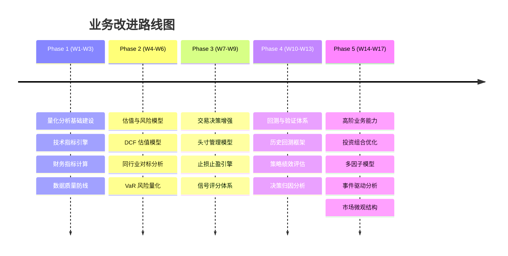
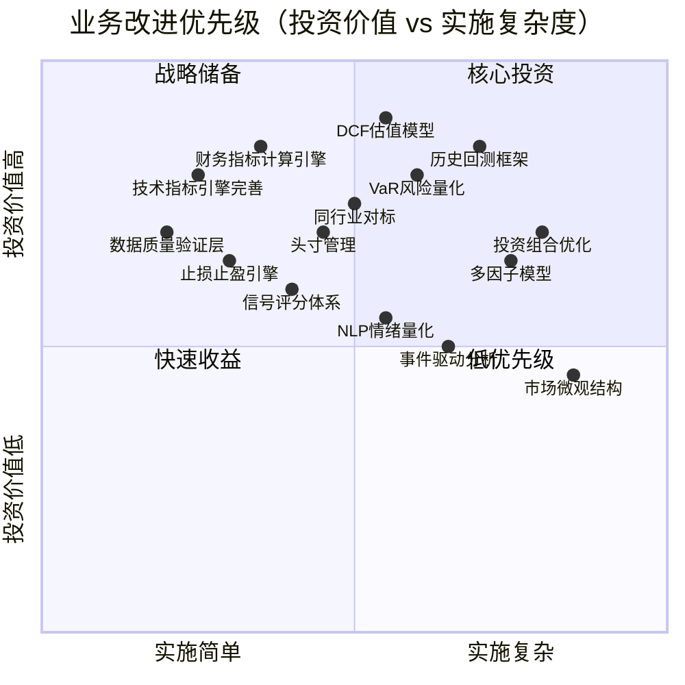
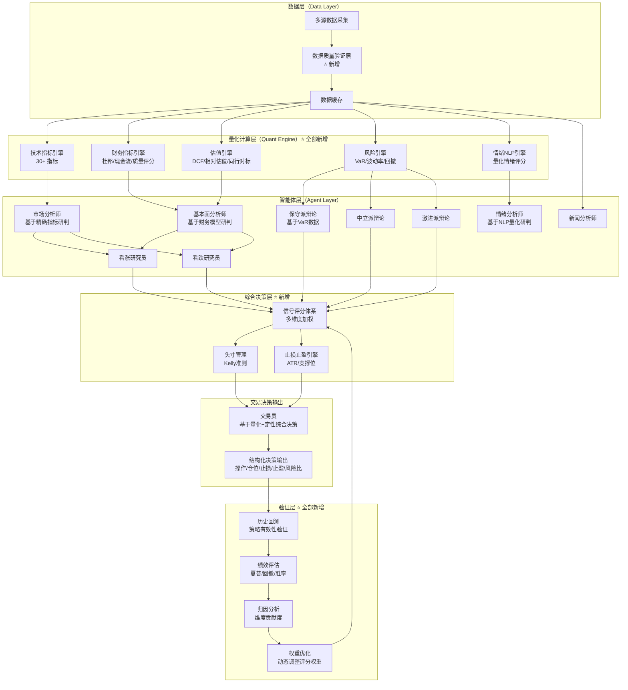

# TradingAgents-CN 业务改进迭代方案

> **文档版本**: v1.0
> **编制日期**: 2026-02-12
> **评审视角**: 资深金融分析师 / 市场交易分析师

---

## 一、业务现状评估

### 1.1 总体评分

从专业金融分析师和交易员视角对系统各业务维度评分：

| 业务维度 | 评分 | 核心问题 |
|---------|------|---------|
| **技术面分析深度** | 5/10 | 有 stockstats 指标计算，但指标覆盖不全，无多时间框架 |
| **基本面分析深度** | 3/10 | 仅 PE/PB/ROE 等基础估值，无 DCF、无同行对标、无现金流 |
| **情绪面分析能力** | 2/10 | 中国社交媒体情绪为占位符实现，无 NLP 情绪量化 |
| **风险管理体系** | 2/10 | 三派辩论为纯文本讨论，无 VaR、无止损、无头寸管理 |
| **交易决策质量** | 4/10 | 强制输出目标价但无计算模型支撑，无风险收益比 |
| **数据质量保障** | 4/10 | 多源降级机制好，但无数据验证、无新鲜度检查 |
| **回测与验证** | 0/10 | 完全缺失，无法验证分析策略的历史有效性 |
| **投资组合管理** | 0/10 | 仅支持单股分析，无跨标的关联分析和组合优化 |

**综合评分：2.5/10**（作为投资辅助工具）

### 1.2 核心架构问题

当前系统最根本的业务架构问题是：**将全部金融分析的专业性转嫁给 LLM 的文本生成能力**。

```
当前模式：
  原始数据 → LLM 文本理解 → LLM 文本推理 → LLM 生成结论
  （无计算）   （可能误读）     （不可控）      （不可验证）

专业模式：
  原始数据 → 量化计算引擎 → 结构化指标 → LLM 综合研判 → 决策输出
  （精确）    （确定性）      （可验证）    （增值分析）    （可追溯）
```

**关键发现**：系统的 LLM Prompt 中列出了大量专业分析要求（DCF、同行对标、风险评估等），但底层**没有任何计算逻辑支撑**。LLM 被要求"凭空"完成本应由量化引擎处理的计算任务。

---

## 二、业务改进总览

### 2.1 改进路线图



### 2.2 优先级矩阵



---

## 三、Phase 1：量化分析基础建设（第 1-3 周）

**目标**：为智能体提供精确的量化数据，替代当前"让 LLM 猜测计算"的模式。

**核心理念**：LLM 擅长综合研判和语言表达，不擅长精确计算。计算交给引擎，研判交给 LLM。

---

### 改进项 1.1：技术指标计算引擎完善

**当前问题**

市场分析师（`market_analyst.py`）的 Prompt 中要求分析 MA、MACD、RSI、布林带等指标，但底层仅依赖 stockstats 库计算了部分指标。以下关键指标**完全缺失**：

| 缺失指标 | 专业用途 | 重要性 |
|---------|---------|--------|
| KDJ 随机指标 | A股技术分析核心指标 | ⭐⭐⭐⭐⭐ |
| ADX（平均趋向指标） | 判断趋势强度 | ⭐⭐⭐⭐ |
| CCI（商品通道指标） | 超买超卖判断 | ⭐⭐⭐ |
| OBV（能量潮） | 量价关系分析 | ⭐⭐⭐⭐ |
| Williams %R | 超买超卖振荡器 | ⭐⭐⭐ |
| 成交量加权均线 VWAP | 机构交易基准 | ⭐⭐⭐⭐⭐ |
| 换手率 | A股活跃度核心指标 | ⭐⭐⭐⭐⭐ |
| 多时间框架分析 | 趋势确认（日/周/月） | ⭐⭐⭐⭐⭐ |

当前 `market_analyst.py` 第 159 行仅请求当日数据（`start_date=current_date`），技术分析无法基于单日数据有效进行。

**改进方案**

1. **新建技术指标引擎** `tradingagents/analysis/technical_engine.py`：

```python
import pandas as pd
import numpy as np
from stockstats import StockDataFrame

class TechnicalEngine:
    """技术指标计算引擎 - 确定性计算，替代LLM猜测"""

    def __init__(self, ohlcv_df: pd.DataFrame):
        self.df = ohlcv_df
        self.sdf = StockDataFrame.retype(ohlcv_df.copy())

    def compute_all(self) -> dict:
        """计算全部技术指标，返回结构化数据"""
        return {
            "trend": self._trend_indicators(),
            "momentum": self._momentum_indicators(),
            "volatility": self._volatility_indicators(),
            "volume": self._volume_indicators(),
            "signals": self._generate_signals(),
            "multi_timeframe": self._multi_timeframe_summary(),
        }

    def _trend_indicators(self) -> dict:
        """趋势指标"""
        return {
            "ma5": self.sdf["close_5_sma"].iloc[-1],
            "ma10": self.sdf["close_10_sma"].iloc[-1],
            "ma20": self.sdf["close_20_sma"].iloc[-1],
            "ma60": self.sdf["close_60_sma"].iloc[-1],
            "ema12": self.sdf["close_12_ema"].iloc[-1],
            "ema26": self.sdf["close_26_ema"].iloc[-1],
            "macd": self.sdf["macd"].iloc[-1],
            "macd_signal": self.sdf["macds"].iloc[-1],
            "macd_hist": self.sdf["macdh"].iloc[-1],
            "adx": self._calc_adx(),
            "trend_direction": self._judge_trend(),  # 上涨/下跌/震荡
            "trend_strength": self._trend_strength(), # 0-100
        }

    def _momentum_indicators(self) -> dict:
        """动量指标"""
        return {
            "rsi_14": self.sdf["rsi_14"].iloc[-1],
            "rsi_6": self.sdf["rsi_6"].iloc[-1],
            "kdj_k": self._calc_kdj()["k"],
            "kdj_d": self._calc_kdj()["d"],
            "kdj_j": self._calc_kdj()["j"],
            "cci": self._calc_cci(),
            "williams_r": self._calc_williams_r(),
            "roc": self._calc_roc(),  # 变动率
            "overbought": self._is_overbought(),  # 超买信号
            "oversold": self._is_oversold(),       # 超卖信号
        }

    def _volatility_indicators(self) -> dict:
        """波动率指标"""
        return {
            "boll_upper": self.sdf["boll_ub"].iloc[-1],
            "boll_middle": self.sdf["boll"].iloc[-1],
            "boll_lower": self.sdf["boll_lb"].iloc[-1],
            "boll_bandwidth": self._boll_bandwidth(),
            "atr_14": self.sdf["atr_14"].iloc[-1],
            "volatility_20d": self._calc_historical_volatility(20),
            "volatility_60d": self._calc_historical_volatility(60),
        }

    def _volume_indicators(self) -> dict:
        """量价指标"""
        return {
            "obv": self._calc_obv(),
            "vwap": self._calc_vwap(),
            "volume_ratio": self._volume_ratio(),      # 量比
            "turnover_rate": self._turnover_rate(),     # 换手率
            "volume_trend": self._volume_trend(),       # 放量/缩量
        }

    def _generate_signals(self) -> list:
        """基于指标自动生成技术信号"""
        signals = []
        # MACD金叉/死叉
        if self._macd_cross_up():
            signals.append({"type": "bullish", "source": "MACD金叉", "strength": 0.7})
        if self._macd_cross_down():
            signals.append({"type": "bearish", "source": "MACD死叉", "strength": 0.7})
        # KDJ超买超卖
        # RSI背离
        # 均线多头/空头排列
        # 布林带突破
        # ... 更多信号规则
        return signals

    def _multi_timeframe_summary(self) -> dict:
        """多时间框架汇总（日线/周线/月线趋势一致性）"""
        return {
            "daily_trend": self._judge_trend(),
            "weekly_trend": self._resample_and_judge("W"),
            "monthly_trend": self._resample_and_judge("M"),
            "alignment": self._timeframe_alignment(),  # 多周期共振
        }
```

2. **在市场分析师中集成引擎**：

修改 `market_analyst.py`，让 LLM 接收**预计算的结构化指标**而非原始 OHLCV 数据：

```python
# 修改后的流程
def market_analyst_node(state):
    # 1. 获取历史数据（至少250个交易日）
    ohlcv = get_market_data(ticker, depth="1y")

    # 2. 引擎计算全部技术指标
    engine = TechnicalEngine(ohlcv)
    indicators = engine.compute_all()

    # 3. 将结构化指标传给LLM进行研判
    prompt = f"""
    以下是{company_name}的技术指标（已由计算引擎精确计算）：

    【趋势指标】
    - 趋势方向: {indicators['trend']['trend_direction']}
    - 趋势强度: {indicators['trend']['trend_strength']}/100
    - MACD: {indicators['trend']['macd']:.4f}（信号线: {indicators['trend']['macd_signal']:.4f}）
    - ADX: {indicators['trend']['adx']:.2f}

    【动量指标】
    - RSI(14): {indicators['momentum']['rsi_14']:.2f} {'⚠️ 超买' if indicators['momentum']['overbought'] else ''}
    - KDJ: K={indicators['momentum']['kdj_k']:.2f} D={indicators['momentum']['kdj_d']:.2f} J={indicators['momentum']['kdj_j']:.2f}

    【波动率指标】
    - 20日历史波动率: {indicators['volatility']['volatility_20d']:.2%}
    - ATR(14): {indicators['volatility']['atr_14']:.2f}
    - 布林带位置: 当前价在带内 {boll_position}

    【量价指标】
    - 量比: {indicators['volume']['volume_ratio']:.2f}
    - 换手率: {indicators['volume']['turnover_rate']:.2%}
    - OBV趋势: {indicators['volume']['obv_trend']}

    【自动信号】
    {format_signals(indicators['signals'])}

    【多周期共振】
    日线: {indicators['multi_timeframe']['daily_trend']}
    周线: {indicators['multi_timeframe']['weekly_trend']}
    月线: {indicators['multi_timeframe']['monthly_trend']}
    共振评估: {indicators['multi_timeframe']['alignment']}

    请基于以上精确指标，给出专业的技术面研判和交易建议。
    """
```

**预期效果**

- 技术指标从"LLM 猜测"变为"引擎精确计算"，分析可靠性大幅提升
- 自动信号检测（金叉/死叉/背离等）减少 LLM 遗漏
- 多时间框架共振分析提供更可靠的趋势判断

---

### 改进项 1.2：财务指标计算引擎

**当前问题**

基本面分析师（`fundamentals_analyst.py`）仅获取 PE/PB 等基础估值指标。以下对投资决策至关重要的财务分析**完全缺失**：

| 缺失维度 | 具体缺失项 | 影响 |
|---------|-----------|------|
| **盈利质量** | 核心利润率趋势、经营现金流/净利润比 | 无法识别财务造假或盈利不可持续 |
| **成长性** | 收入/利润 YoY/QoQ 增长率、CAGR | 无法判断增长阶段 |
| **现金流** | FCF、经营/投资/筹资现金流 | 无法评估真实盈利能力 |
| **债务结构** | 债务/EBITDA、利息覆盖率 | 无法评估财务风险 |
| **杜邦分析** | ROE 三因素拆解 | 无法深入理解盈利驱动力 |
| **分红回购** | 股息率趋势、回购规模 | 无法评估股东回报 |

`fundamentals_analyst.py` 第 121-130 行仅获取 10 天数据范围，这对于季度/年度财务分析远远不够。

**改进方案**

1. **新建财务指标引擎** `tradingagents/analysis/fundamental_engine.py`：

```python
class FundamentalEngine:
    """财务指标计算引擎"""

    def __init__(self, financials: dict, market_data: dict):
        self.fin = financials
        self.mkt = market_data

    def compute_all(self) -> dict:
        return {
            "valuation": self._valuation_metrics(),
            "profitability": self._profitability_metrics(),
            "growth": self._growth_metrics(),
            "cash_flow": self._cash_flow_metrics(),
            "debt_health": self._debt_health_metrics(),
            "dupont": self._dupont_analysis(),
            "quality_score": self._quality_score(),
            "shareholder_return": self._shareholder_return(),
        }

    def _valuation_metrics(self) -> dict:
        """估值指标"""
        return {
            "pe_ttm": self._calc_pe_ttm(),
            "pe_forward": self._calc_pe_forward(),
            "pb": self._calc_pb(),
            "ps": self._calc_ps(),
            "peg": self._calc_peg(),
            "ev_ebitda": self._calc_ev_ebitda(),
            "ev_sales": self._calc_ev_sales(),
            "pe_percentile_3y": self._pe_historical_percentile(3),  # 3年PE分位
            "pe_percentile_5y": self._pe_historical_percentile(5),  # 5年PE分位
            "valuation_level": self._judge_valuation(),  # 低估/合理/高估
        }

    def _profitability_metrics(self) -> dict:
        """盈利能力"""
        return {
            "gross_margin": self._gross_margin(),
            "operating_margin": self._operating_margin(),
            "net_margin": self._net_margin(),
            "roe": self._calc_roe(),
            "roa": self._calc_roa(),
            "roic": self._calc_roic(),
            "margin_trend": self._margin_trend_3y(),  # 利润率趋势
        }

    def _growth_metrics(self) -> dict:
        """成长性"""
        return {
            "revenue_yoy": self._revenue_growth_yoy(),
            "revenue_qoq": self._revenue_growth_qoq(),
            "profit_yoy": self._profit_growth_yoy(),
            "eps_growth": self._eps_growth(),
            "revenue_cagr_3y": self._revenue_cagr(3),
            "revenue_cagr_5y": self._revenue_cagr(5),
            "growth_stage": self._judge_growth_stage(),  # 高速/稳定/放缓/衰退
        }

    def _cash_flow_metrics(self) -> dict:
        """现金流分析"""
        return {
            "operating_cf": self._operating_cash_flow(),
            "investing_cf": self._investing_cash_flow(),
            "financing_cf": self._financing_cash_flow(),
            "free_cash_flow": self._free_cash_flow(),
            "fcf_yield": self._fcf_yield(),
            "ocf_to_net_income": self._ocf_to_ni_ratio(),  # >1 为高质量
            "cash_flow_health": self._judge_cf_health(),
        }

    def _debt_health_metrics(self) -> dict:
        """债务健康"""
        return {
            "debt_to_equity": self._debt_to_equity(),
            "debt_to_ebitda": self._debt_to_ebitda(),
            "interest_coverage": self._interest_coverage(),
            "current_ratio": self._current_ratio(),
            "quick_ratio": self._quick_ratio(),
            "debt_risk_level": self._judge_debt_risk(),  # 低/中/高
        }

    def _dupont_analysis(self) -> dict:
        """杜邦分析 - ROE 三因素拆解"""
        npm = self._net_margin()
        tat = self._asset_turnover()
        em = self._equity_multiplier()
        return {
            "net_profit_margin": npm,       # 销售净利率
            "asset_turnover": tat,          # 资产周转率
            "equity_multiplier": em,        # 权益乘数
            "roe_decomposed": npm * tat * em,
            "main_driver": self._identify_roe_driver(),  # ROE主驱动力
        }

    def _quality_score(self) -> dict:
        """盈利质量评分（0-100）"""
        scores = {
            "accrual_quality": self._accrual_quality(),       # 应计质量
            "cash_conversion": self._cash_conversion(),       # 现金转换效率
            "revenue_quality": self._revenue_quality(),       # 收入质量
            "earnings_persistence": self._earnings_persistence(),  # 盈利持续性
        }
        scores["total"] = sum(scores.values()) / len(scores)
        return scores
```

**预期效果**

基本面分析从"让 LLM 看几个数字下结论"升级为"引擎系统计算 + LLM 综合研判"，覆盖估值、盈利、成长、现金流、债务、杜邦六大维度。

---

### 改进项 1.3：数据质量验证层

**当前问题**

系统对外部数据源返回的数据**完全信任**，无任何验证机制。已发现的问题：
- 美股数据范围硬编码到 2025-03-25（已过期）
- 无异常值检测（如价格为 0、成交量为负数）
- 无数据新鲜度校验
- 无数据完整性检查（缺失字段、NaN 值）

**改进方案**

新建 `tradingagents/analysis/data_validator.py`：

```python
class DataValidator:
    """金融数据质量验证层"""

    def validate_ohlcv(self, df: pd.DataFrame) -> ValidationResult:
        """验证OHLCV数据质量"""
        errors = []
        warnings = []

        # 1. 完整性检查
        required = ["open", "high", "low", "close", "volume"]
        for col in required:
            if col not in df.columns:
                errors.append(f"缺失必需字段: {col}")

        # 2. 价格合理性
        if (df["close"] <= 0).any():
            errors.append("存在非正价格")
        if (df["high"] < df["low"]).any():
            errors.append("存在最高价低于最低价的异常数据")
        if (df["close"] > df["high"]).any() or (df["close"] < df["low"]).any():
            errors.append("存在收盘价超出最高/最低价范围的数据")

        # 3. 涨跌幅异常检测（A股±10%/±20%/±30%，美股无限制但极端波动预警）
        daily_returns = df["close"].pct_change()
        extreme = daily_returns.abs() > 0.20
        if extreme.any():
            warnings.append(f"存在{extreme.sum()}个交易日涨跌幅超过20%")

        # 4. 新鲜度检查
        latest_date = df.index.max()
        stale_days = (pd.Timestamp.now() - latest_date).days
        if stale_days > 5:  # 考虑周末和节假日
            warnings.append(f"数据最新日期为{latest_date.date()}，已过期{stale_days}天")

        # 5. 缺失值检查
        nan_pct = df.isna().mean()
        for col, pct in nan_pct.items():
            if pct > 0.1:
                warnings.append(f"字段{col}缺失率{pct:.1%}")

        return ValidationResult(
            is_valid=len(errors) == 0,
            errors=errors,
            warnings=warnings,
            quality_score=self._calc_quality_score(errors, warnings),
        )

    def validate_fundamentals(self, data: dict) -> ValidationResult:
        """验证基本面数据质量"""
        errors = []
        # PE为负数 → 标注"亏损状态"而非错误
        # ROE超过100% → 标注异常
        # 市值为0 → 数据错误
        ...

    def validate_news(self, articles: list) -> ValidationResult:
        """验证新闻数据质量"""
        # 去重检测
        # 时效性检查
        # 来源可信度评估
        ...
```

**预期效果**

所有进入分析流程的数据经过质量验证，数据异常自动标注并传递给 LLM 作为分析上下文。

---

## 四、Phase 2：估值与风险模型（第 4-6 周）

**目标**：建立专业级估值和风险量化能力。

---

### 改进项 2.1：DCF 内在价值估值模型

**当前问题**

系统完全不具备内在价值评估能力。基本面分析师仅基于 PE/PB 等相对指标判断"高估/低估"，但缺乏内在价值锚定。DCF（现金流折现）是全球机构投资者最核心的估值方法。

**改进方案**

新建 `tradingagents/analysis/valuation/dcf_model.py`：

```python
class DCFModel:
    """两阶段DCF估值模型"""

    def __init__(self, financials: dict, assumptions: dict = None):
        self.fin = financials
        self.assumptions = assumptions or self._default_assumptions()

    def estimate_intrinsic_value(self) -> dict:
        """计算内在价值"""
        # 阶段1：高增长期（5年）
        fcf_projections = self._project_fcf(years=5)

        # 阶段2：永续增长期
        terminal_value = self._terminal_value(
            last_fcf=fcf_projections[-1],
            terminal_growth=self.assumptions["terminal_growth_rate"],
            wacc=self._calc_wacc()
        )

        # 折现
        pv_fcf = self._discount_cash_flows(fcf_projections)
        pv_terminal = terminal_value / (1 + self._calc_wacc()) ** 5

        enterprise_value = pv_fcf + pv_terminal
        equity_value = enterprise_value - self.fin["net_debt"]
        intrinsic_per_share = equity_value / self.fin["shares_outstanding"]

        return {
            "intrinsic_value": intrinsic_per_share,
            "current_price": self.fin["current_price"],
            "upside_potential": (intrinsic_per_share / self.fin["current_price"] - 1),
            "margin_of_safety": self._margin_of_safety(intrinsic_per_share),
            "sensitivity": self._sensitivity_analysis(),  # 敏感性分析
            "wacc": self._calc_wacc(),
            "assumptions_used": self.assumptions,
        }

    def _sensitivity_analysis(self) -> dict:
        """敏感性分析：WACC ± 1% × 终端增长率 ± 0.5%"""
        results = {}
        for wacc_delta in [-0.01, 0, 0.01]:
            for tg_delta in [-0.005, 0, 0.005]:
                key = f"WACC{wacc_delta:+.1%}_TG{tg_delta:+.1%}"
                results[key] = self._calc_with_params(
                    wacc=self._calc_wacc() + wacc_delta,
                    terminal_growth=self.assumptions["terminal_growth_rate"] + tg_delta,
                )
        return results

    def _calc_wacc(self) -> float:
        """加权平均资本成本"""
        # CAPM: Re = Rf + β × (Rm - Rf)
        re = self.assumptions["risk_free_rate"] + \
             self.fin["beta"] * self.assumptions["equity_risk_premium"]
        rd = self.fin["cost_of_debt"] * (1 - self.fin["tax_rate"])
        d_ratio = self.fin["total_debt"] / (self.fin["total_debt"] + self.fin["market_cap"])
        e_ratio = 1 - d_ratio
        return re * e_ratio + rd * d_ratio
```

**与 LLM 的集成方式**：

DCF 引擎计算内在价值 → 将数值结果和敏感性分析表传给 LLM → LLM 判断假设合理性并给出研判意见。

```python
# 在基本面分析师中集成
dcf = DCFModel(financials)
valuation = dcf.estimate_intrinsic_value()

prompt = f"""
DCF估值引擎计算结果：
- 内在价值: {valuation['intrinsic_value']:.2f} {currency}
- 当前价格: {valuation['current_price']:.2f} {currency}
- 上涨空间: {valuation['upside_potential']:.1%}
- 安全边际: {valuation['margin_of_safety']:.1%}
- WACC: {valuation['wacc']:.2%}

敏感性分析（内在价值随WACC和终端增长率的变化）：
{format_sensitivity_table(valuation['sensitivity'])}

请评估以上估值假设的合理性，并结合行业特点给出你的判断。
"""
```

---

### 改进项 2.2：同行业对标分析（Peer Comparison）

**当前问题**

系统仅分析单只股票，不与同行业公司对比。投资决策中"相对估值"与"绝对估值"同等重要。

**改进方案**

新建 `tradingagents/analysis/valuation/peer_comparison.py`：

```python
class PeerComparison:
    """同行业对标分析"""

    def __init__(self, target_ticker: str, industry: str):
        self.target = target_ticker
        self.industry = industry
        self.peers = self._find_peers()  # 自动查找同行业公司

    def compare(self) -> dict:
        return {
            "valuation_comparison": self._compare_valuation(),
            "profitability_comparison": self._compare_profitability(),
            "growth_comparison": self._compare_growth(),
            "ranking": self._overall_ranking(),
            "peer_list": self.peers,
        }

    def _compare_valuation(self) -> pd.DataFrame:
        """估值对标"""
        # 返回 DataFrame:
        # | 公司 | PE(TTM) | PB | PS | EV/EBITDA | 分位数 |
        ...

    def _compare_profitability(self) -> pd.DataFrame:
        """盈利能力对标"""
        # | 公司 | ROE | 毛利率 | 净利率 | ROIC |
        ...

    def _overall_ranking(self) -> dict:
        """综合排名"""
        return {
            "target_rank": 3,       # 在同行中的排名
            "total_peers": 10,      # 同行数量
            "strengths": ["ROE行业第2", "毛利率高于行业均值20%"],
            "weaknesses": ["PE高于行业中位数35%", "增速低于行业平均"],
        }
```

---

### 改进项 2.3：VaR 风险量化与风险评分模型

**当前问题**

风险管理层（保守派/中立派/激进派辩论）完全基于 LLM 文本讨论，**没有任何量化风险指标**。交易员被要求输出"风险评分 0-1"，但该评分无计算依据。

`aggressive_debator.py` 第 39-51 行仅用文本 Prompt 描述风险立场，无量化支撑。`trader.py` 第 75-76 行要求输出风险评分，但完全依赖 LLM 主观判断。

**改进方案**

新建 `tradingagents/analysis/risk/risk_engine.py`：

```python
class RiskEngine:
    """量化风险评估引擎"""

    def __init__(self, price_history: pd.Series, market_index: pd.Series = None):
        self.prices = price_history
        self.returns = price_history.pct_change().dropna()
        self.market = market_index

    def compute_all(self) -> dict:
        return {
            "var": self._value_at_risk(),
            "volatility": self._volatility_metrics(),
            "drawdown": self._drawdown_metrics(),
            "beta": self._calc_beta(),
            "sharpe": self._calc_sharpe(),
            "risk_score": self._composite_risk_score(),
        }

    def _value_at_risk(self) -> dict:
        """Value at Risk（在险价值）"""
        return {
            "var_95_1d": np.percentile(self.returns, 5),       # 95%置信度1日VaR
            "var_99_1d": np.percentile(self.returns, 1),       # 99%置信度1日VaR
            "cvar_95": self.returns[self.returns <= np.percentile(self.returns, 5)].mean(),
            "interpretation": f"95%概率下，单日最大亏损不超过{abs(np.percentile(self.returns, 5)):.2%}"
        }

    def _volatility_metrics(self) -> dict:
        """波动率指标"""
        return {
            "daily_vol": self.returns.std(),
            "annualized_vol": self.returns.std() * np.sqrt(252),
            "vol_20d": self.returns.tail(20).std() * np.sqrt(252),
            "vol_60d": self.returns.tail(60).std() * np.sqrt(252),
            "vol_regime": self._vol_regime(),  # 低波/正常/高波
        }

    def _drawdown_metrics(self) -> dict:
        """回撤分析"""
        cum_returns = (1 + self.returns).cumprod()
        rolling_max = cum_returns.cummax()
        drawdown = (cum_returns - rolling_max) / rolling_max
        return {
            "max_drawdown": drawdown.min(),
            "max_dd_duration_days": self._max_dd_duration(drawdown),
            "current_drawdown": drawdown.iloc[-1],
            "recovery_status": "已恢复" if drawdown.iloc[-1] == 0 else "回撤中",
        }

    def _calc_beta(self) -> float:
        """Beta系数（相对市场指数）"""
        if self.market is None:
            return None
        market_returns = self.market.pct_change().dropna()
        aligned = pd.concat([self.returns, market_returns], axis=1).dropna()
        cov = aligned.cov().iloc[0, 1]
        var = market_returns.var()
        return cov / var

    def _calc_sharpe(self, risk_free_rate: float = 0.03) -> float:
        """夏普比率"""
        excess_return = self.returns.mean() * 252 - risk_free_rate
        return excess_return / (self.returns.std() * np.sqrt(252))

    def _composite_risk_score(self) -> dict:
        """综合风险评分（0-100，越高风险越大）"""
        scores = {
            "volatility_score": self._score_volatility(),     # 0-25
            "drawdown_score": self._score_drawdown(),         # 0-25
            "var_score": self._score_var(),                   # 0-25
            "liquidity_score": self._score_liquidity(),       # 0-25
        }
        total = sum(scores.values())
        return {
            **scores,
            "total": total,
            "level": "低风险" if total < 30 else "中风险" if total < 60 else "高风险",
        }
```

**与风险管理辩论层的集成**：

```python
# 风险辩论前，先计算量化风险指标
risk_data = risk_engine.compute_all()

# 传给三派辩论者
conservative_prompt = f"""
量化风险数据（已由风险引擎计算）：
- VaR(95%,1日): {risk_data['var']['var_95_1d']:.2%}（即95%概率下单日最大亏损）
- 年化波动率: {risk_data['volatility']['annualized_vol']:.2%}
- 最大回撤: {risk_data['drawdown']['max_drawdown']:.2%}
- Beta: {risk_data['beta']:.2f}
- 夏普比率: {risk_data['sharpe']:.2f}
- 综合风险评分: {risk_data['risk_score']['total']}/100 ({risk_data['risk_score']['level']})

基于以上量化数据，请从保守派角度论述该投资的风险...
"""
```

**预期效果**

风险辩论从"三人纯文字讨论"升级为"基于量化数据的论据交锋"，风险评分有科学计算支撑。

---

## 五、Phase 3：交易决策增强（第 7-9 周）

**目标**：将交易员从"输出一段建议文本"升级为"输出可执行的交易方案"。

---

### 改进项 3.1：头寸管理模型

**当前问题**

交易员（`trader.py`）仅输出"买入/持有/卖出"的定性建议，不涉及：
- 应该投入多少资金？（头寸规模）
- 占总资金的百分比？（资金分配）
- 不同风险偏好下如何调整？

**改进方案**

新建 `tradingagents/analysis/trading/position_sizing.py`：

```python
class PositionSizer:
    """头寸管理模型"""

    def __init__(self, account_size: float, risk_tolerance: str = "moderate"):
        self.account = account_size
        self.risk_tolerance = risk_tolerance
        self.max_single_position = self._max_position_pct()

    def calculate(self, entry_price: float, stop_loss: float,
                  confidence: float, risk_score: float) -> dict:
        """计算建议头寸"""
        # Kelly准则（保守版本：半凯利）
        kelly_fraction = self._half_kelly(confidence, risk_score)

        # 基于止损的头寸计算
        risk_per_share = abs(entry_price - stop_loss)
        max_risk_amount = self.account * self._risk_per_trade()
        shares_by_risk = int(max_risk_amount / risk_per_share) if risk_per_share > 0 else 0

        # 基于资金比例的头寸限制
        max_shares_by_pct = int(self.account * self.max_single_position / entry_price)

        # 取较小值
        recommended_shares = min(shares_by_risk, max_shares_by_pct)
        position_value = recommended_shares * entry_price

        return {
            "recommended_shares": recommended_shares,
            "position_value": position_value,
            "position_pct": position_value / self.account,
            "risk_amount": recommended_shares * risk_per_share,
            "risk_pct": (recommended_shares * risk_per_share) / self.account,
            "kelly_fraction": kelly_fraction,
            "reasoning": self._explain(recommended_shares, shares_by_risk, max_shares_by_pct),
        }

    def _risk_per_trade(self) -> float:
        """每笔交易的最大风险占比"""
        return {"conservative": 0.01, "moderate": 0.02, "aggressive": 0.03}[self.risk_tolerance]

    def _max_position_pct(self) -> float:
        """单只股票最大仓位占比"""
        return {"conservative": 0.05, "moderate": 0.10, "aggressive": 0.20}[self.risk_tolerance]
```

---

### 改进项 3.2：止损止盈引擎

**当前问题**

`trader.py` 第 74 行提示中提到"止损位"，但无计算逻辑。第 67 行强制要求输出目标价，但目标价无任何计算模型支撑。

**改进方案**

新建 `tradingagents/analysis/trading/exit_strategy.py`：

```python
class ExitStrategy:
    """止损止盈策略引擎"""

    def __init__(self, entry_price: float, atr: float, support_levels: list,
                 resistance_levels: list, risk_reward_min: float = 2.0):
        self.entry = entry_price
        self.atr = atr
        self.supports = sorted(support_levels)
        self.resistances = sorted(resistance_levels)
        self.rr_min = risk_reward_min

    def calculate(self) -> dict:
        """计算止损止盈方案"""
        stop_loss = self._calc_stop_loss()
        take_profit = self._calc_take_profit(stop_loss)
        risk = abs(self.entry - stop_loss)
        reward = abs(take_profit - self.entry)

        return {
            "stop_loss": stop_loss,
            "stop_loss_pct": (stop_loss - self.entry) / self.entry,
            "take_profit": take_profit,
            "take_profit_pct": (take_profit - self.entry) / self.entry,
            "risk_reward_ratio": reward / risk if risk > 0 else 0,
            "trailing_stop": self._trailing_stop(),
            "partial_exits": self._partial_exit_plan(),
        }

    def _calc_stop_loss(self) -> float:
        """多策略止损（取最优）"""
        strategies = {
            "atr_stop": self.entry - 2 * self.atr,           # 2倍ATR止损
            "support_stop": self._nearest_support_below(),     # 支撑位下方止损
            "pct_stop": self.entry * 0.95,                     # 固定5%止损
        }
        # 选择最接近但不过分紧密的止损位
        return max(strategies.values())  # 最高的止损位=最小亏损

    def _partial_exit_plan(self) -> list:
        """分批止盈计划"""
        return [
            {"pct_position": 0.33, "target": self.entry * 1.05, "reason": "第一目标位：+5%"},
            {"pct_position": 0.33, "target": self._nearest_resistance(), "reason": "阻力位止盈"},
            {"pct_position": 0.34, "target": None, "reason": "移动止盈跟踪"},
        ]
```

---

### 改进项 3.3：综合信号评分体系

**当前问题**

交易员从 4 个分析师 + 2 个研究员 + 3 个风险管理员收到大量文本意见，但无量化综合方法。最终决策质量高度依赖 LLM 对长文本的理解能力。

**改进方案**

新建 `tradingagents/analysis/scoring/signal_scorer.py`：

```python
class SignalScorer:
    """多维度信号综合评分"""

    # 各维度权重（可配置）
    DEFAULT_WEIGHTS = {
        "technical": 0.25,       # 技术面权重
        "fundamental": 0.30,     # 基本面权重
        "sentiment": 0.15,       # 情绪面权重
        "news": 0.10,            # 新闻面权重
        "risk": 0.20,            # 风险面权重
    }

    def score(self, technical: dict, fundamental: dict,
              sentiment: dict, news: dict, risk: dict) -> dict:
        """计算综合评分"""
        scores = {
            "technical": self._score_technical(technical),
            "fundamental": self._score_fundamental(fundamental),
            "sentiment": self._score_sentiment(sentiment),
            "news": self._score_news(news),
            "risk": self._score_risk(risk),
        }

        weighted_score = sum(
            scores[k] * self.DEFAULT_WEIGHTS[k] for k in scores
        )

        return {
            "dimension_scores": scores,
            "weighted_total": weighted_score,  # 0-100
            "signal": self._to_signal(weighted_score),
            "confidence": self._calc_confidence(scores),
            "divergence": self._detect_divergence(scores),  # 多维度分歧检测
        }

    def _to_signal(self, score: float) -> str:
        if score >= 70: return "强烈买入"
        if score >= 60: return "买入"
        if score >= 45: return "持有"
        if score >= 35: return "卖出"
        return "强烈卖出"

    def _detect_divergence(self, scores: dict) -> dict:
        """检测维度间的分歧"""
        values = list(scores.values())
        spread = max(values) - min(values)
        return {
            "spread": spread,
            "is_divergent": spread > 40,
            "bullish_dimensions": [k for k, v in scores.items() if v >= 60],
            "bearish_dimensions": [k for k, v in scores.items() if v <= 40],
            "warning": "⚠️ 各维度信号存在显著分歧，建议降低仓位" if spread > 40 else None,
        }
```

**与交易员的集成**：

```python
# 在交易员决策前，先计算综合评分
scorer = SignalScorer()
composite = scorer.score(
    technical=tech_engine.compute_all(),
    fundamental=fund_engine.compute_all(),
    sentiment=sentiment_data,
    news=news_data,
    risk=risk_engine.compute_all(),
)

trader_prompt = f"""
【量化综合评分】（100分制）
- 技术面: {composite['dimension_scores']['technical']}/100
- 基本面: {composite['dimension_scores']['fundamental']}/100
- 情绪面: {composite['dimension_scores']['sentiment']}/100
- 新闻面: {composite['dimension_scores']['news']}/100
- 风险面: {composite['dimension_scores']['risk']}/100
- 综合加权: {composite['weighted_total']:.1f}/100
- 量化信号: {composite['signal']}
- 置信度: {composite['confidence']:.1%}
{composite['divergence']['warning'] or ''}

【风险量化数据】
- VaR(95%): {risk_data['var']['var_95_1d']:.2%}
- 最大回撤: {risk_data['drawdown']['max_drawdown']:.2%}
- 夏普比率: {risk_data['sharpe']:.2f}

【估值模型结果】
- DCF内在价值: {dcf_value:.2f} {currency}（当前价{current_price:.2f}，空间{upside:.1%}）
- 同行PE中位数: {peer_pe_median:.1f}（本股PE: {pe:.1f}）

【头寸建议】
- 建议仓位: {position['position_pct']:.1%}（{position['recommended_shares']}股）
- 止损位: {exit['stop_loss']:.2f}（-{abs(exit['stop_loss_pct']):.1%}）
- 第一止盈: {exit['partial_exits'][0]['target']:.2f}
- 风险收益比: {exit['risk_reward_ratio']:.1f}:1

请基于以上量化分析结果，结合研究员辩论和风险管理讨论的定性观点，给出最终投资决策。
"""
```

---

## 六、Phase 4：回测与验证体系（第 10-13 周）

**目标**：建立策略回测和绩效评估能力，验证分析的历史有效性。

---

### 改进项 4.1：历史回测框架

**当前问题**

系统**完全没有回测能力**。无法回答"过去一年，系统的买入建议实际收益如何？"这一最基本的策略验证问题。

**改进方案**

新建 `tradingagents/backtest/` 模块：

```python
class BacktestEngine:
    """策略回测引擎"""

    def run(self, signals: list[Signal], price_data: pd.DataFrame,
            initial_capital: float = 1_000_000) -> BacktestResult:
        """回测信号序列"""
        portfolio = Portfolio(initial_capital)

        for signal in signals:
            date = signal.date
            price = price_data.loc[date, "close"]

            if signal.action == "买入":
                shares = self.position_sizer.calculate(...)
                portfolio.buy(signal.ticker, shares, price, date)
            elif signal.action == "卖出":
                portfolio.sell(signal.ticker, price, date)

            # 检查止损
            portfolio.check_stop_losses(price_data.loc[date])

        return BacktestResult(
            total_return=portfolio.total_return(),
            annualized_return=portfolio.annualized_return(),
            max_drawdown=portfolio.max_drawdown(),
            sharpe_ratio=portfolio.sharpe_ratio(),
            win_rate=portfolio.win_rate(),
            profit_factor=portfolio.profit_factor(),
            trade_count=portfolio.trade_count(),
            avg_holding_days=portfolio.avg_holding_days(),
            monthly_returns=portfolio.monthly_returns(),
            equity_curve=portfolio.equity_curve(),
        )
```

---

### 改进项 4.2：策略绩效评估报告

**改进方案**

新建 `tradingagents/backtest/performance.py`：

```python
class PerformanceReport:
    """策略绩效评估"""

    def generate(self, result: BacktestResult, benchmark: pd.Series) -> dict:
        return {
            "return_metrics": {
                "total_return": result.total_return,
                "annualized_return": result.annualized_return,
                "benchmark_return": self._benchmark_return(benchmark),
                "alpha": result.annualized_return - self._benchmark_return(benchmark),
                "information_ratio": self._information_ratio(result, benchmark),
            },
            "risk_metrics": {
                "max_drawdown": result.max_drawdown,
                "sharpe_ratio": result.sharpe_ratio,
                "sortino_ratio": self._sortino_ratio(result),
                "calmar_ratio": result.annualized_return / abs(result.max_drawdown),
            },
            "trade_metrics": {
                "win_rate": result.win_rate,
                "profit_factor": result.profit_factor,
                "avg_win": result.avg_win,
                "avg_loss": result.avg_loss,
                "expectancy": result.expectancy(),  # 每笔交易期望收益
            },
            "consistency": {
                "profitable_months_pct": self._profitable_months(result),
                "max_consecutive_losses": result.max_consecutive_losses,
                "monthly_return_std": result.monthly_returns.std(),
            },
        }
```

---

### 改进项 4.3：决策归因分析

**改进方案**

新建 `tradingagents/backtest/attribution.py`：

```python
class AttributionAnalysis:
    """决策归因分析 - 哪个维度对正确/错误决策贡献最大"""

    def analyze(self, historical_decisions: list) -> dict:
        """分析历史决策中各维度评分与最终收益的相关性"""
        return {
            "dimension_contribution": {
                "technical": self._correlation("technical_score", "actual_return"),
                "fundamental": self._correlation("fundamental_score", "actual_return"),
                "sentiment": self._correlation("sentiment_score", "actual_return"),
                "news": self._correlation("news_score", "actual_return"),
                "risk": self._correlation("risk_score", "actual_return"),
            },
            "best_predictor": "fundamental",   # 最准确的预测维度
            "worst_predictor": "sentiment",     # 最不准确的维度
            "optimal_weights": self._optimize_weights(),  # 基于历史数据优化权重
            "recommendations": self._generate_recommendations(),
        }
```

---

## 七、Phase 5：高阶业务能力（第 14-17 周）

**目标**：构建专业级投资分析高阶能力。

---

### 改进项 5.1：投资组合优化

**当前问题**：系统仅支持单股分析，无法回答"我持有 5 只股票，应该如何调整配比？"

**改进方案**

新建 `tradingagents/portfolio/optimizer.py`：

```python
class PortfolioOptimizer:
    """投资组合优化（Markowitz均值-方差模型）"""

    def optimize(self, tickers: list, expected_returns: dict,
                 covariance_matrix: pd.DataFrame,
                 risk_tolerance: float = 0.5) -> dict:
        """计算最优投资组合权重"""
        # 使用scipy.optimize求解
        # 目标函数: max(return - risk_tolerance * variance)
        # 约束: 权重之和 = 1, 0 <= 每个权重 <= 0.3
        return {
            "weights": optimal_weights,           # 各标的权重
            "expected_return": portfolio_return,   # 组合预期收益
            "expected_risk": portfolio_risk,       # 组合预期风险
            "sharpe_ratio": portfolio_sharpe,      # 组合夏普比率
            "efficient_frontier": frontier_points, # 有效前沿
            "diversification_ratio": div_ratio,    # 分散化比率
            "correlation_matrix": corr_matrix,     # 相关性矩阵
        }
```

---

### 改进项 5.2：多因子选股模型

**改进方案**

新建 `tradingagents/analysis/factor_model.py`：

```python
class MultiFactorModel:
    """多因子选股模型"""

    FACTORS = {
        "value": ["pe_percentile", "pb_percentile", "ev_ebitda_percentile"],
        "growth": ["revenue_growth", "eps_growth", "roe_trend"],
        "momentum": ["return_1m", "return_3m", "return_6m", "rsi"],
        "quality": ["roe", "debt_ratio", "cash_flow_quality", "earnings_stability"],
        "sentiment": ["analyst_consensus", "insider_trading", "social_sentiment"],
    }

    def score_stock(self, ticker: str) -> dict:
        """计算个股多因子得分"""
        return {
            "factor_scores": {factor: self._calc_factor(ticker, factor)
                             for factor in self.FACTORS},
            "composite_score": self._weighted_composite(ticker),
            "factor_exposure": self._factor_exposure(ticker),
            "style_classification": self._classify_style(ticker),  # 价值/成长/均衡
        }

    def screen(self, universe: list, top_n: int = 20) -> list:
        """多因子筛选前N只股票"""
        scores = [(t, self.score_stock(t)["composite_score"]) for t in universe]
        return sorted(scores, key=lambda x: x[1], reverse=True)[:top_n]
```

---

### 改进项 5.3：事件驱动分析引擎

**当前问题**

新闻分析师仅做"正面/负面/中性"的粗粒度判断，不具备事件分类和历史事件类比能力。

**改进方案**

新建 `tradingagents/analysis/event_driven.py`：

```python
class EventAnalyzer:
    """事件驱动分析引擎"""

    EVENT_TYPES = {
        "earnings": "财报发布",
        "dividend": "分红送转",
        "mgmt_change": "管理层变动",
        "ma": "并购重组",
        "regulation": "政策监管",
        "product_launch": "新产品发布",
        "lawsuit": "诉讼仲裁",
        "rating_change": "评级变动",
        "insider_trade": "内部人交易",
        "macro": "宏观经济事件",
    }

    def analyze_event(self, event_text: str, ticker: str) -> dict:
        """分析单个事件的市场影响"""
        event_type = self._classify_event(event_text)
        historical_impact = self._find_similar_events(event_type, ticker)

        return {
            "event_type": event_type,
            "urgency": self._assess_urgency(event_text),       # 紧急/重要/一般
            "expected_impact": self._estimate_impact(historical_impact),
            "historical_precedents": historical_impact[:5],      # 历史相似事件
            "avg_price_reaction": historical_impact["avg_return"],
            "reaction_duration_days": historical_impact["avg_duration"],
            "suggested_action": self._suggest_action(historical_impact),
        }
```

---

### 改进项 5.4：NLP 情绪量化引擎

**当前问题**

社交媒体分析师（`social_media_analyst.py`）的中国社交媒体情绪获取为**占位符实现**（代码中实际标注为未真正集成）。情绪评分完全由 LLM 主观判断。

**改进方案**

新建 `tradingagents/analysis/sentiment/nlp_engine.py`：

```python
class SentimentNLPEngine:
    """NLP情绪量化引擎"""

    def analyze_texts(self, texts: list[str]) -> dict:
        """批量文本情绪分析"""
        sentiments = [self._score_single(text) for text in texts]
        return {
            "scores": sentiments,
            "aggregate": {
                "mean_score": np.mean([s["score"] for s in sentiments]),
                "bullish_pct": len([s for s in sentiments if s["score"] > 0.2]) / len(sentiments),
                "bearish_pct": len([s for s in sentiments if s["score"] < -0.2]) / len(sentiments),
                "neutral_pct": len([s for s in sentiments if abs(s["score"]) <= 0.2]) / len(sentiments),
            },
            "trending_topics": self._extract_topics(texts),
            "emotion_distribution": self._emotion_distribution(sentiments),
            "fear_greed_index": self._fear_greed_index(sentiments),
        }

    def _score_single(self, text: str) -> dict:
        """单条文本情绪评分 (-1.0 到 1.0)"""
        # 方案A: 使用SnowNLP（中文情感分析）
        # 方案B: 使用LLM但结构化输出（JSON mode）
        # 方案C: 使用预训练的FinBERT模型
        ...
```

---

## 八、改进架构总览

### 8.1 改进后的系统架构



### 8.2 改进前后对比

| 维度 | 改进前 | 改进后 |
|------|--------|--------|
| **技术分析** | LLM 看文字猜指标 | 引擎精确计算 30+ 指标 + LLM 研判 |
| **基本面分析** | 看 PE/PB 数字下结论 | DCF 估值 + 杜邦分析 + 同行对标 + LLM 研判 |
| **情绪分析** | 占位符 / LLM 主观判断 | NLP 量化评分 + 恐惧贪婪指数 |
| **风险评估** | 三人纯文字辩论 | VaR + 波动率 + 回撤 + 量化风险评分 → 辩论 |
| **交易决策** | "买入/持有/卖出" 文本 | 操作 + 仓位 + 止损 + 止盈 + 风险收益比 |
| **策略验证** | 无 | 历史回测 + 绩效评估 + 归因分析 |
| **组合管理** | 单股分析 | Markowitz 组合优化 + 多因子筛选 |

---

## 九、验收标准

| Phase | 关键验收指标 |
|-------|------------|
| **Phase 1** | ✅ 技术指标引擎覆盖 30+ 指标（含 KDJ/ADX/OBV/VWAP/换手率） |
| | ✅ 财务指标引擎覆盖估值/盈利/成长/现金流/债务/杜邦六大维度 |
| | ✅ 数据验证层拦截率 > 95%（异常价格、缺失数据、过期数据） |
| | ✅ LLM Prompt 中的数据改为引擎预计算值而非原始文本 |
| **Phase 2** | ✅ DCF 模型含敏感性分析（3×3 矩阵） |
| | ✅ 同行业对标覆盖估值/盈利/成长三维度 |
| | ✅ VaR 风险引擎输出 95%/99% 置信度 VaR + 最大回撤 + 夏普比率 |
| | ✅ 综合风险评分有量化计算公式而非 LLM 主观评分 |
| **Phase 3** | ✅ 头寸管理基于 Kelly 准则输出具体股数和仓位比例 |
| | ✅ 止损止盈包含 ATR 止损 + 支撑位止损 + 分批止盈方案 |
| | ✅ 综合评分体系输出 0-100 分 + 五维度分项 + 分歧检测 |
| | ✅ 交易员输出从"文本建议"升级为"可执行交易方案" |
| **Phase 4** | ✅ 回测框架可运行至少 1 年历史数据的策略回测 |
| | ✅ 绩效报告包含收益/风险/交易/一致性四大类指标 |
| | ✅ 归因分析可识别最佳/最差预测维度 |
| **Phase 5** | ✅ 组合优化输出有效前沿和最优权重 |
| | ✅ 多因子模型覆盖价值/成长/动量/质量/情绪五大因子 |
| | ✅ 事件驱动分析可找到历史相似事件及平均价格反应 |

---

## 十、免责声明

本文档所述改进方案旨在提升系统的**分析专业性和方法论严谨性**。即使全部改进实施完成，系统输出仍**仅供学习和参考**，不构成任何投资建议。金融市场具有高度不确定性，任何分析模型和量化系统都无法保证投资收益。

**投资有风险，入市需谨慎。**
