# TradingAgents-CN 业务程序流程图

> **文档版本**: v1.0
> **项目版本**: v1.0.0-preview
> **编制日期**: 2026-02-11

---

## 1. 系统总体流程

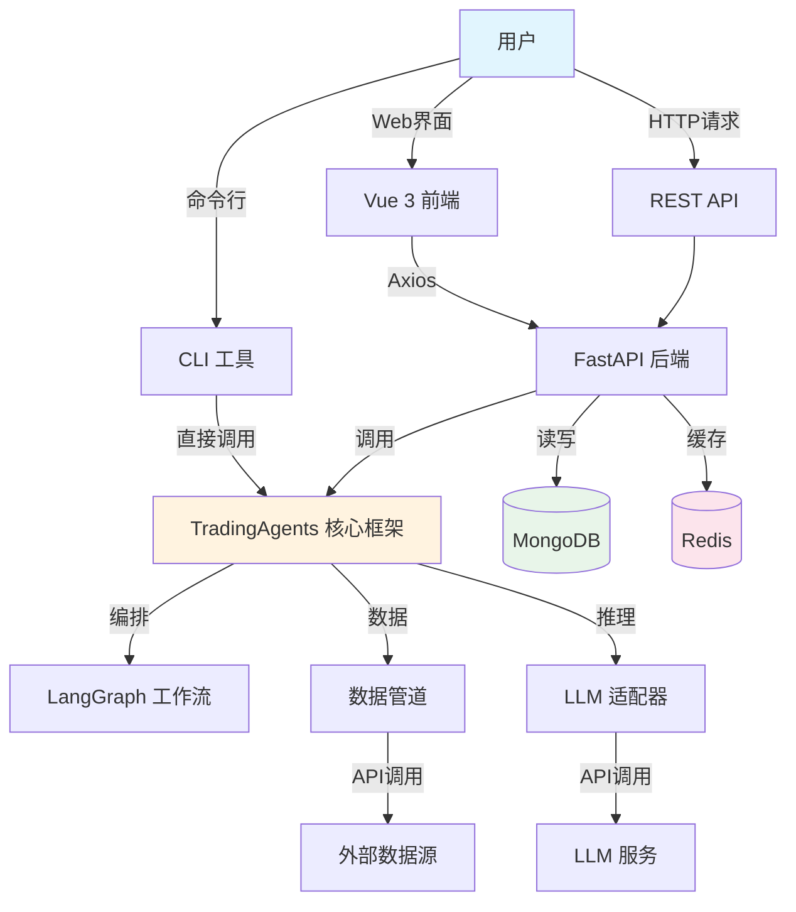

---

## 2. 核心分析流程

### 2.1 单股分析全流程

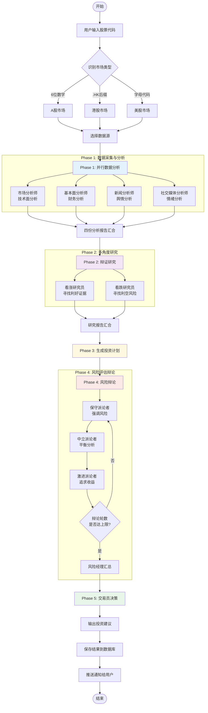

### 2.2 数据源降级流程

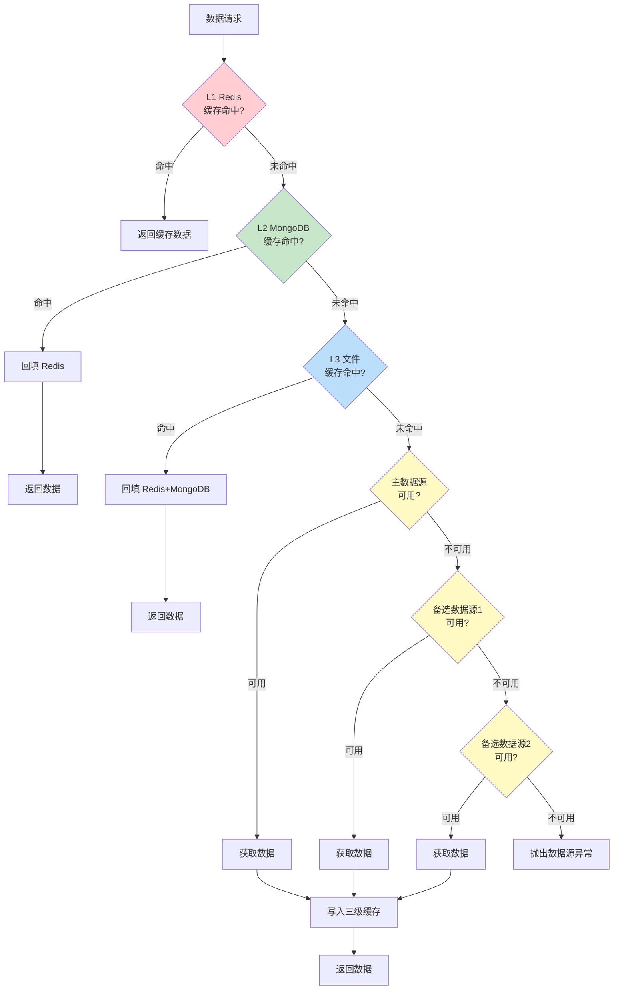

---

## 3. Web 应用流程

### 3.1 用户认证流程

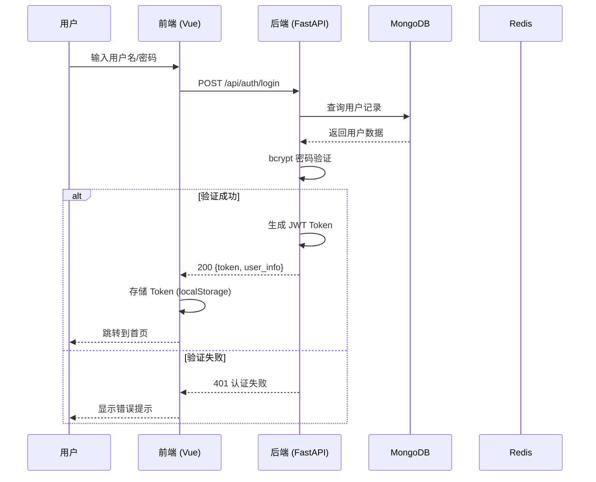

### 3.2 单股分析请求流程

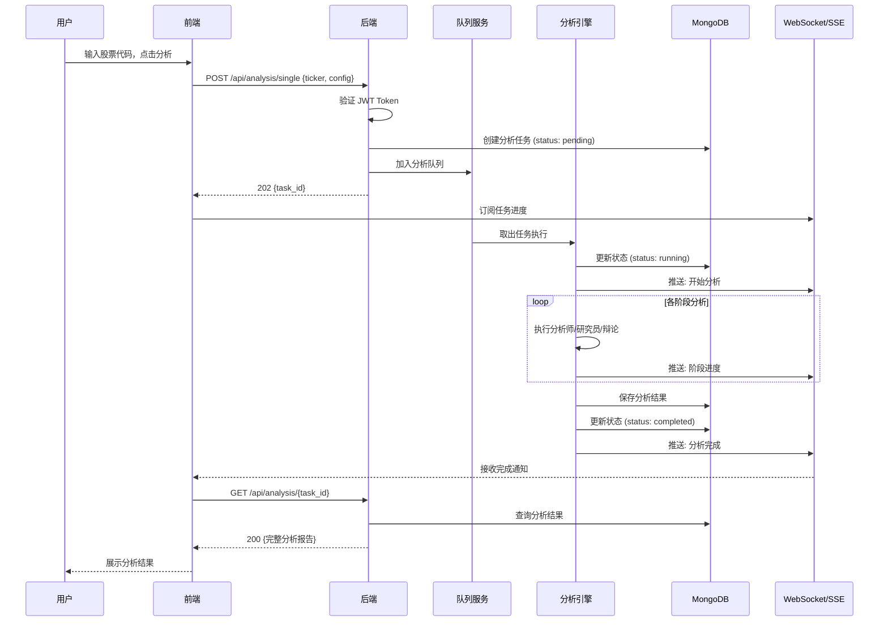

### 3.3 报告导出流程

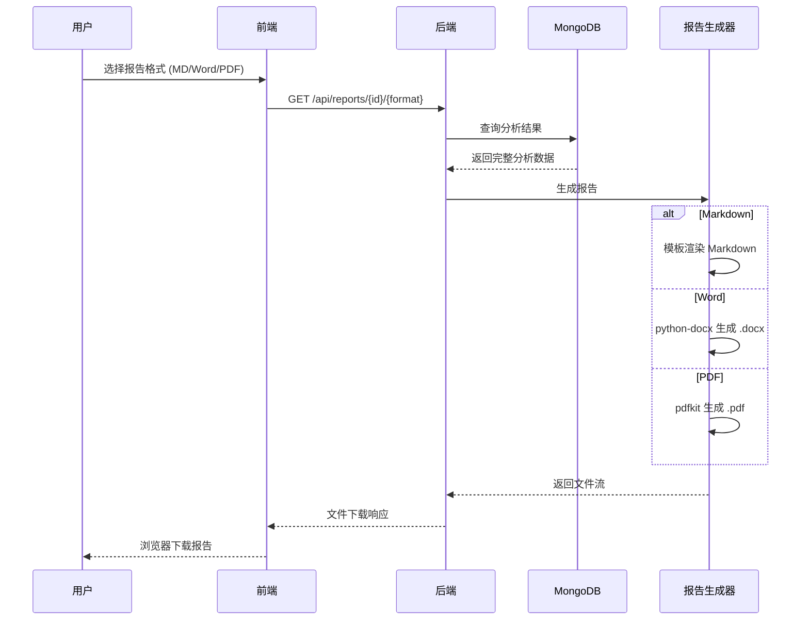

---

## 4. 数据同步流程

### 4.1 定时数据同步

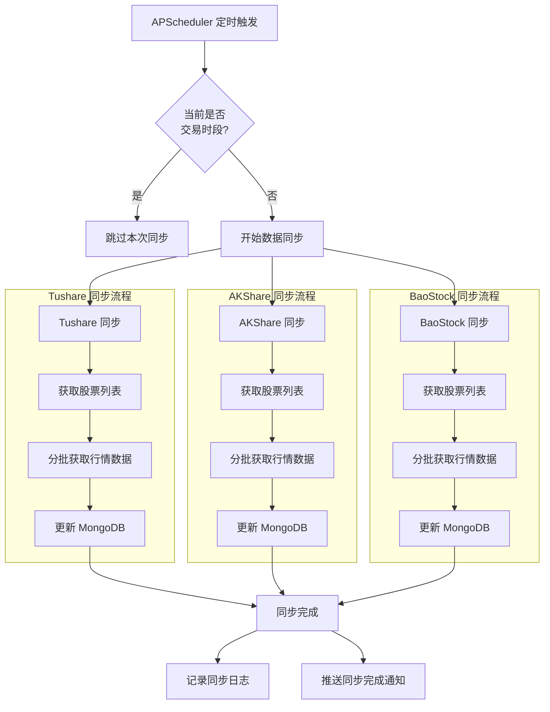

---

## 5. CLI 执行流程

```mermaid
graph TD
    CMD[python -m cli.main<br/>"600036" deepseek] --> PARSE[解析命令行参数]

    PARSE --> LOAD_ENV[加载环境变量 .env]
    LOAD_ENV --> INIT_CONFIG[初始化配置]
    INIT_CONFIG --> INIT_GRAPH[初始化 TradingAgentsGraph]

    INIT_GRAPH --> INIT_LLM[初始化 LLM 客户端]
    INIT_LLM --> INIT_DATA[初始化数据管道]
    INIT_DATA --> BUILD_GRAPH[构建 LangGraph 工作流图]

    BUILD_GRAPH --> PROPAGATE[执行前向传播<br/>propagate]

    subgraph "前向传播"
        PROPAGATE --> P_ANALYSTS[执行四个分析师]
        P_ANALYSTS --> P_RESEARCHERS[执行研究员辩论]
        P_RESEARCHERS --> P_PLAN[生成投资计划]
        P_PLAN --> P_RISK[风险辩论]
        P_RISK --> P_TRADER[交易员决策]
    end

    P_TRADER --> REFLECT[执行反思学习<br/>reflect]

    subgraph "反思学习"
        REFLECT --> R_MEMORY[检索历史记忆]
        R_MEMORY --> R_IMPROVE[基于历史改进分析]
    end

    R_IMPROVE --> SIGNAL[信号处理]
    SIGNAL --> OUTPUT_CLI[输出投资建议到终端]
    OUTPUT_CLI --> END_CLI([结束])

    style PROPAGATE fill:#e3f2fd
    style REFLECT fill:#f3e5f5
    style SIGNAL fill:#e8f5e9
```

---

## 6. 智能体内部流程

### 6.1 单个分析师工作流程

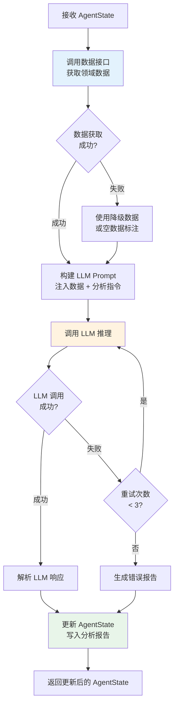

### 6.2 风险辩论循环流程

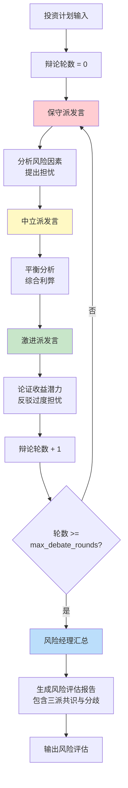

---

## 7. LLM 调用流程

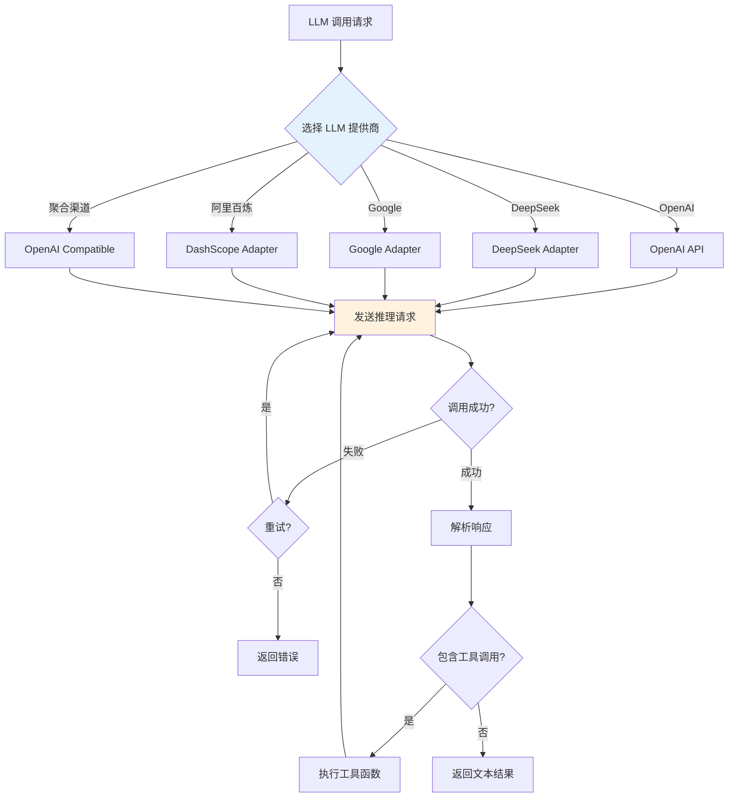

---

## 8. 前端组件交互流程

### 8.1 分析页面交互

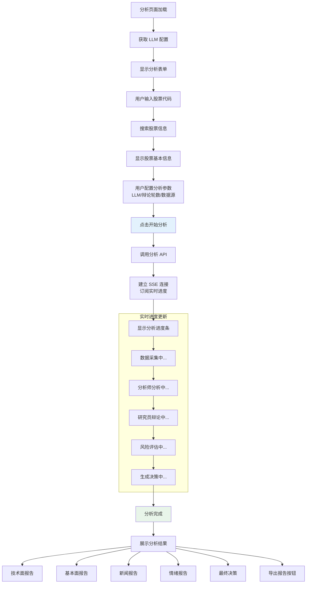

---

## 9. 错误处理流程

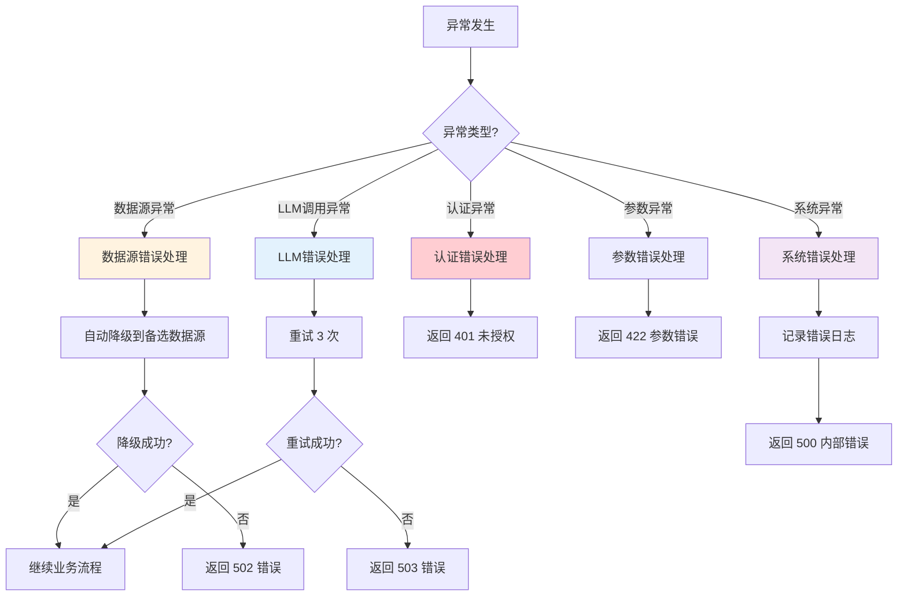

---

## 10. 系统启动流程

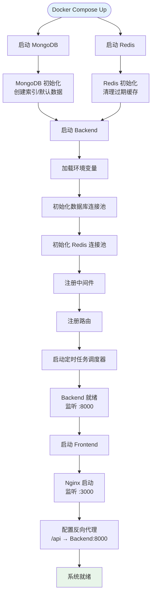
