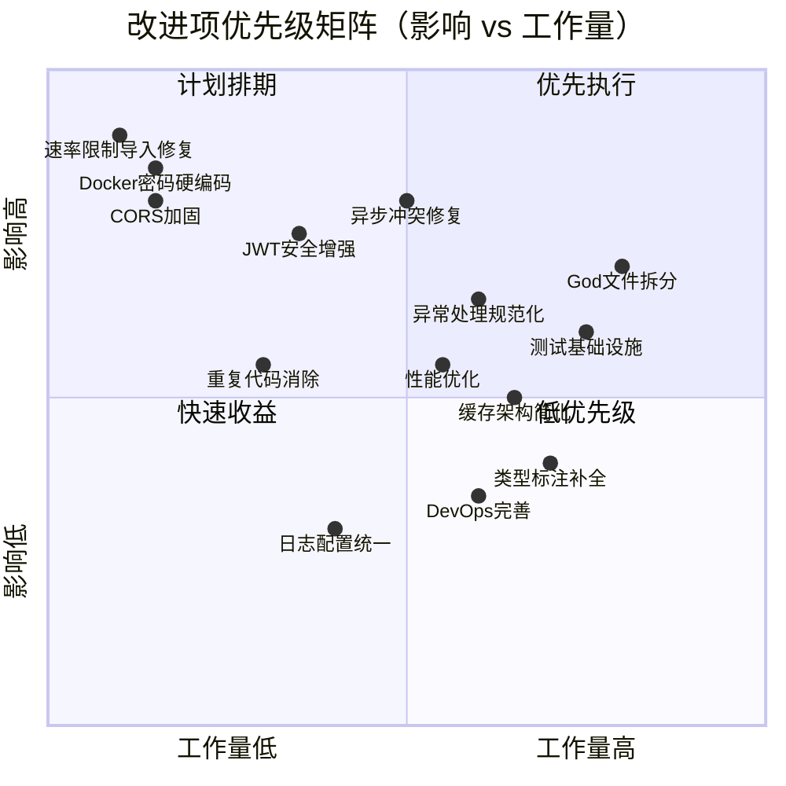
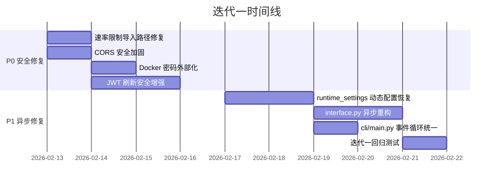
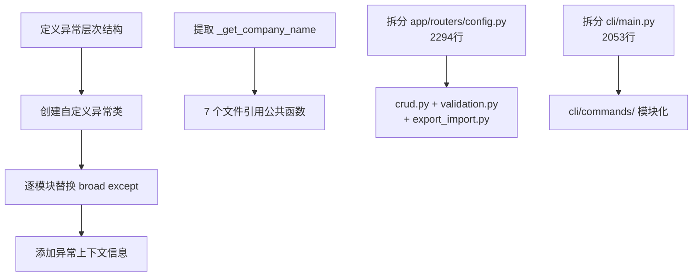
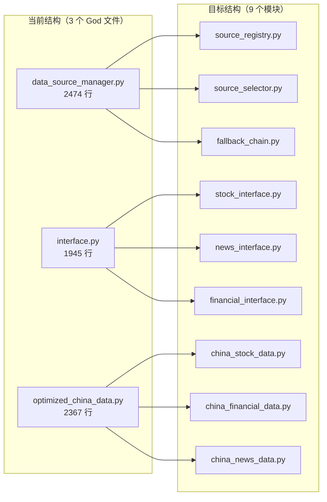
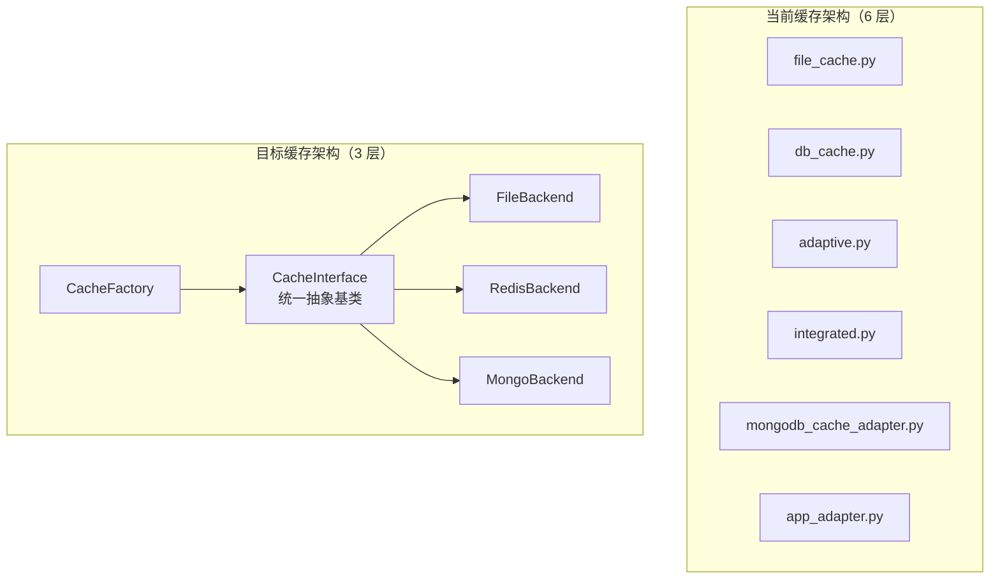
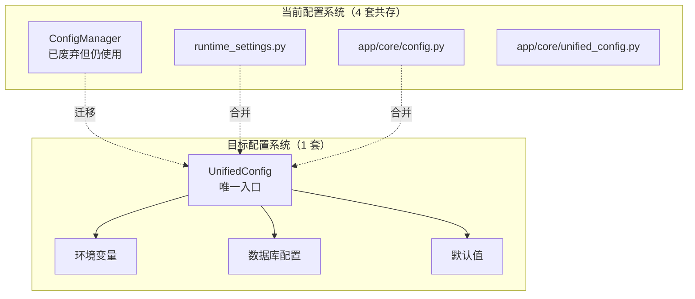
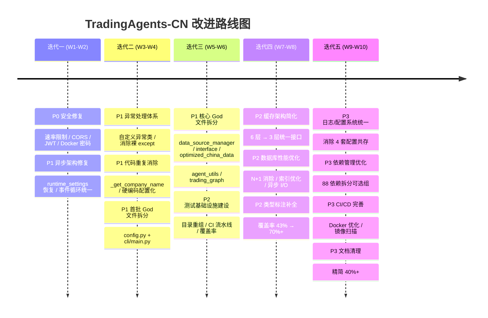

# TradingAgents-CN 改进迭代分析与方案

> **文档版本**: v1.0
> **基线分支**: main (commit ab70d77)
> **分析日期**: 2026-02-12
> **预计总工期**: 8-10 周（5 个迭代）

---

## 一、优先级矩阵



### 总览表

| 优先级 | 类别 | 改进项数 | 迭代阶段 |
|--------|------|----------|----------|
| **P0** | 安全漏洞与关键 Bug | 4 项 | 迭代一 |
| **P1** | 异步架构修复 | 2 项 | 迭代一 |
| **P1** | 异常处理 + 代码重复消除 + God 文件拆分（首批） | 4 项 | 迭代二 |
| **P1** | God 文件拆分（核心模块） + 测试基础设施 | 4 项 | 迭代三 |
| **P2** | 缓存架构 + 性能优化 + 类型安全 | 3 项 | 迭代四 |
| **P3** | DevOps + 日志/配置统一 + 文档清理 | 5 项 | 迭代五 |

---

## 二、问题发现汇总

在对代码库进行全面分析后，共发现 **11 类 40+ 个具体问题**：

| # | 问题类别 | 严重度 | 典型表现 |
|---|---------|--------|---------|
| 1 | 安全漏洞 | 🔴 严重 | 速率限制中间件导入路径错误导致完全失效 |
| 2 | 硬编码密码 | 🔴 严重 | docker-compose.yml 中明文密码 `tradingagents123` |
| 3 | CORS 过于宽松 | 🟠 高 | `allow_headers=["*"]`，无 `max_age` |
| 4 | JWT 安全缺陷 | 🟠 高 | refresh token 无 IP 绑定，旧 token 未失效 |
| 5 | 异步/同步冲突 | 🟠 高 | 动态配置被完全禁用作为"临时修复" |
| 6 | God 文件 | 🟡 中 | 8 个文件超 1000 行，最大 2474 行 |
| 7 | 代码重复 | 🟡 中 | `_get_company_name()` 在 5+ 文件中重复 |
| 8 | 异常处理 | 🟡 中 | 508 处 `except Exception`，24 处裸 `except:` |
| 9 | 测试薄弱 | 🟡 中 | conftest.py 仅 9 行，无 CI 测试流水线 |
| 10 | 类型安全 | 🔵 低 | 仅 43% 文件使用 typing 导入 |
| 11 | DevOps 缺陷 | 🔵 低 | 依赖锁文件过期，无 CHANGELOG |

---

## 三、迭代计划

---

### 迭代一：安全加固与异步架构修复（第 1-2 周）

**目标**：消除全部 P0 安全漏洞，修复异步/同步冲突的根本原因。

**风险评估**：
- 🟡 中等风险：速率限制和 CORS 修复为低风险单点修改；异步冲突修复涉及核心数据流，需充分回归测试
- 缓解措施：异步修复先在独立分支验证，配合集成测试后合入



---

#### 改进项 1.1：速率限制中间件导入路径修复

| 属性 | 说明 |
|------|------|
| **优先级** | P0 🔴 |
| **影响** | 速率限制功能完全失效，API 无防护 |

**问题描述**

`app/middleware/rate_limit.py` 第 10 行使用 `from core.redis_client import ...`，缺少 `app.` 前缀，导致模块加载失败。速率限制中间件无法注册到 FastAPI 应用，所有 API 端点处于无限速状态。

**受影响文件**

| 文件 | 行号 | 修改类型 |
|------|------|---------|
| `app/middleware/rate_limit.py` | 第 10 行 | 修正导入路径 |
| `app/main.py` | 中间件注册处 | 验证注册正常 |

**实施步骤**

1. 将 `from core.redis_client` 改为 `from app.core.redis_client`
2. 检查 `app/middleware/` 下所有文件是否存在同类导入问题
3. 添加单元测试验证中间件可正常实例化：
   ```python
   def test_rate_limit_middleware_import():
       from app.middleware.rate_limit import RateLimitMiddleware
       assert RateLimitMiddleware is not None
   ```
4. 在 `app/main.py` 中确认 `RateLimitMiddleware` 被正确注册并生效

**预期效果**

速率限制中间件正常工作，API 端点受到速率保护，防止暴力破解和滥用。

---

#### 改进项 1.2：CORS 配置安全加固

| 属性 | 说明 |
|------|------|
| **优先级** | P0 🔴 |
| **影响** | 攻击面过大，预检请求频繁 |

**问题描述**

`app/main.py` 第 621-627 行 CORS 配置过于宽松：
- `allow_headers=["*"]` 允许所有请求头，扩大攻击面
- 缺少 `max_age` 参数，导致浏览器每次请求都发送 OPTIONS 预检

**受影响文件**

| 文件 | 行号 | 修改类型 |
|------|------|---------|
| `app/main.py` | 第 621-627 行 | 修改 CORS 配置 |
| `app/core/config.py` | Settings 类 | 新增配置项 |

**实施步骤**

1. 替换 `allow_headers=["*"]` 为明确白名单：
   ```python
   allow_headers=["Authorization", "Content-Type", "Accept", "X-Request-ID"]
   ```
2. 添加 `max_age=600`（10 分钟预检缓存）
3. 在 `app/core/config.py` 的 Settings 中新增：
   ```python
   CORS_ALLOWED_HEADERS: list[str] = ["Authorization", "Content-Type", "Accept", "X-Request-ID"]
   CORS_MAX_AGE: int = 600
   ```
4. 确保 `allow_origins` 在生产环境不使用 `*`，改为从环境变量读取

**预期效果**

减少攻击面，预检请求缓存降低网络开销，生产环境跨域策略可控。

---

#### 改进项 1.3：JWT Token 刷新安全增强

| 属性 | 说明 |
|------|------|
| **优先级** | P0 🔴 |
| **影响** | Token 可被重放攻击利用 |

**问题描述**

`app/routers/auth_db.py` 第 219-250 行的 refresh token 刷新流程存在三个安全缺陷：
1. 缺少 IP 绑定和设备指纹验证
2. 旧 refresh token 刷新后未失效（可重放攻击）
3. 第 248 行 refresh token 和 access token 使用同一个 `create_access_token` 函数，语义混淆

**受影响文件**

| 文件 | 行号 | 修改类型 |
|------|------|---------|
| `app/routers/auth_db.py` | 第 219-250 行 | 核心修复 |
| `app/core/database.py` | - | 新增 token 黑名单集合 |

**实施步骤**

1. 在 token payload 中增加 `client_ip` 和 `device_id` 字段
2. refresh 时校验请求来源 IP 与 token 中记录是否一致
3. 实现 refresh token 轮转机制：
   - 刷新成功后将旧 token 的 `jti` 加入 Redis 黑名单
   - 黑名单 TTL = token 剩余有效期
4. 分离 `create_refresh_token()` 和 `create_access_token()` 函数
5. 实现重用检测：若已失效的 token 被再次使用，标记该用户全部 token 失效

**预期效果**

防止 token 重放攻击，增强会话安全性，token 创建语义清晰。

---

#### 改进项 1.4：Docker Compose 密码外部化

| 属性 | 说明 |
|------|------|
| **优先级** | P0 🔴 |
| **影响** | 明文密码泄露到代码仓库 |

**问题描述**

`docker-compose.yml` 第 34-35、104、133、182-183 行硬编码 `tradingagents123` 作为 MongoDB 和 Redis 密码。该密码已随代码推送到公开/私有仓库，任何有仓库访问权限的人都可获取。

**受影响文件**

| 文件 | 行号 | 修改类型 |
|------|------|---------|
| `docker-compose.yml` | 第 34-35、104、133、182-183 行 | 环境变量替换 |
| `.env.example` | - | 新增密码模板 |
| `docker-compose.hub.nginx.yml` | - | 同步修改 |

**实施步骤**

1. 替换所有硬编码密码为环境变量引用：
   ```yaml
   environment:
     MONGO_INITDB_ROOT_PASSWORD: ${MONGO_PASSWORD:?请在.env中设置MONGO_PASSWORD}
     REDIS_PASSWORD: ${REDIS_PASSWORD:?请在.env中设置REDIS_PASSWORD}
   ```
2. 在 `.env.example` 中添加：
   ```bash
   # ⚠️ 必须修改！请设置强密码
   MONGO_PASSWORD=<请替换为强密码>
   REDIS_PASSWORD=<请替换为强密码>
   ```
3. 同步修改其他 compose 文件
4. 可选：提供 `scripts/generate_secrets.sh` 自动生成随机密码
5. 在 `部署运维手册.md` 中补充首次部署密码配置说明

**预期效果**

代码仓库中不再包含明文密码，新部署强制要求用户设置密码。

---

#### 改进项 1.5：runtime_settings 动态配置恢复

| 属性 | 说明 |
|------|------|
| **优先级** | P1 🟠 |
| **影响** | 动态配置功能完全不可用 |

**问题描述**

`tradingagents/config/runtime_settings.py` 第 41-44 行，动态配置获取函数被硬编码返回空字典 `{}`，标注为"临时修复"。根本原因是在已运行的 asyncio 事件循环中同步调用异步函数（Motor 异步 MongoDB 客户端），导致 `RuntimeError: This event loop is already running`。

相关提交记录：
- `24282f9` - refactor: 系统性解决事件循环冲突问题
- `03a9bc2` - fix: 修复统一新闻工具的事件循环冲突问题

**受影响文件**

| 文件 | 行号 | 修改类型 |
|------|------|---------|
| `tradingagents/config/runtime_settings.py` | 第 41-44 行 | 核心修复 |
| `tradingagents/dataflows/interface.py` | 第 189 行 | ThreadPoolExecutor 修复 |
| `cli/main.py` | 第 1203、1231、1286、1330 行 | 事件循环统一 |

**实施步骤**

**方案 A（推荐）：纯同步路径**

1. 在 `runtime_settings.py` 中使用 `pymongo` 同步客户端（而非 Motor）读取配置，彻底避免 asyncio 依赖：
   ```python
   from pymongo import MongoClient

   def get_runtime_settings() -> dict:
       client = MongoClient(MONGO_URI, serverSelectionTimeoutMS=2000)
       try:
           db = client[DB_NAME]
           config = db.configurations.find_one({"config_type": "runtime"})
           return config.get("config_data", {}) if config else {}
       except Exception:
           return {}
       finally:
           client.close()
   ```

**方案 B：独立线程执行**

1. 使用 `concurrent.futures.ThreadPoolExecutor` 在独立线程中运行异步代码：
   ```python
   import asyncio
   from concurrent.futures import ThreadPoolExecutor

   _executor = ThreadPoolExecutor(max_workers=1)

   def get_runtime_settings() -> dict:
       loop = asyncio.new_event_loop()
       try:
           return loop.run_until_complete(_async_get_settings())
       finally:
           loop.close()
   ```

2. 在 `interface.py` 第 189 行统一使用 `asyncio.to_thread()` 替代手动 `ThreadPoolExecutor`
3. 在 `cli/main.py` 中提取事件循环管理为独立函数，消除 4 处重复代码

**预期效果**

动态配置功能恢复，CLI 和 Web 两种入口下均可正常读取运行时配置。

---

#### 改进项 1.6：cli/main.py 事件循环管理统一

| 属性 | 说明 |
|------|------|
| **优先级** | P1 🟠 |
| **影响** | 代码重复，维护困难 |

**问题描述**

`cli/main.py` 中有 4 处几乎相同的事件循环管理代码（第 1203、1231、1286、1330 行），每处都包含：获取/创建事件循环 → 运行异步函数 → 异常处理。

**受影响文件**

| 文件 | 行号 | 修改类型 |
|------|------|---------|
| `cli/main.py` | 第 1203、1231、1286、1330 行 | 提取公共函数 |

**实施步骤**

1. 提取通用的事件循环执行函数：
   ```python
   def run_async(coro, error_msg: str = "异步操作失败"):
       """安全地在同步上下文中执行异步协程"""
       try:
           loop = asyncio.get_event_loop()
           if loop.is_running():
               import nest_asyncio
               nest_asyncio.apply()
           return loop.run_until_complete(coro)
       except RuntimeError:
           loop = asyncio.new_event_loop()
           asyncio.set_event_loop(loop)
           try:
               return loop.run_until_complete(coro)
           finally:
               loop.close()
       except Exception as e:
           logger.error(f"{error_msg}: {e}")
           raise
   ```
2. 将 4 处重复代码替换为 `run_async()` 调用
3. 编写单元测试覆盖正常执行和异常路径

**预期效果**

事件循环管理逻辑统一维护，消除 4 处代码重复。

---

### 迭代二：代码质量提升 — 异常处理与重复消除（第 3-4 周）

**目标**：建立统一异常处理体系，消除高频代码重复，开始拆分首批 God 文件。

**风险评估**：
- 🟢 低风险：异常处理改造为渐进式修改，不改变业务逻辑；God 文件拆分需谨慎处理导入路径
- 缓解措施：每个文件拆分前先编写集成测试锁定行为



---

#### 改进项 2.1：建立统一异常处理体系

| 属性 | 说明 |
|------|------|
| **优先级** | P1 🟠 |
| **影响** | 508 处宽泛捕获 + 24 处裸 except 导致错误排查困难 |

**问题描述**

全项目存在 **508 处 `except Exception`** 和 **24 处裸 `except:`** 捕获。大量异常被静默吞噬，例如：

- `tradingagents/llm_adapters/openai_compatible_base.py` 第 130 行：裸 `except:` 隐藏 LangChain 版本兼容错误
- `tradingagents/llm_adapters/openai_compatible_base.py` 第 193-194 行：token 跟踪失败被 warning 吞没
- `tradingagents/dataflows/providers/china/akshare.py`：10 处泛异常捕获

**受影响文件**

| 文件 | 修改类型 |
|------|---------|
| 新建 `tradingagents/exceptions.py` | 自定义异常层次 |
| 新建 `app/core/exceptions.py` | Web 层异常定义 |
| `tradingagents/llm_adapters/` 全部文件 | 第一批改造 |
| `tradingagents/dataflows/cache/` 全部文件 | 第一批改造 |
| `tradingagents/agents/utils/` 全部文件 | 第一批改造 |
| `pyproject.toml` | 添加 ruff 规则禁止裸 except |

**实施步骤**

1. 定义异常基类层次：
   ```python
   # tradingagents/exceptions.py
   class TradingAgentsError(Exception):
       """所有业务异常的基类"""

   class DataSourceError(TradingAgentsError):
       """数据源相关异常"""

   class DataSourceUnavailableError(DataSourceError):
       """数据源不可用"""

   class LLMAdapterError(TradingAgentsError):
       """LLM 适配器异常"""

   class LLMRateLimitError(LLMAdapterError):
       """LLM 速率限制"""

   class CacheError(TradingAgentsError):
       """缓存操作异常"""

   class ConfigError(TradingAgentsError):
       """配置相关异常"""
   ```

2. 在 `app/core/exceptions.py` 中定义 Web 层异常：
   ```python
   class APIError(Exception):
       def __init__(self, status_code: int, detail: str, error_code: str):
           self.status_code = status_code
           self.detail = detail
           self.error_code = error_code
   ```

3. 优先处理 24 处裸 `except:` — 全部替换为具体异常类型
4. 分批处理 `except Exception`：第一批覆盖 `llm_adapters/`、`dataflows/cache/`、`agents/utils/`
5. 在 `pyproject.toml` 中添加 ruff 规则：
   ```toml
   [tool.ruff.lint]
   select = ["E", "W", "F", "B", "SIM"]
   # B001: 禁止裸 except
   # B028: 要求 stacklevel
   ```

**预期效果**

异常信息精确，错误排查效率大幅提升；生产环境日志可区分业务异常与系统故障；lint 防止未来新增裸 except。

---

#### 改进项 2.2：消除 `_get_company_name` 重复代码

| 属性 | 说明 |
|------|------|
| **优先级** | P1 🟠 |
| **影响** | 7 个文件中的重复代码，违反 DRY |

**问题描述**

`_get_company_name()` 函数在 5 个 analyst 文件 + 2 个 researcher 文件中重复定义，每处实现 50-80 行，逻辑几乎相同：判断市场类型 → 查找公司名称 → 返回默认值。

重复出现在：
- `tradingagents/agents/analysts/market_analyst.py` 第 17-90 行
- `tradingagents/agents/analysts/fundamentals_analyst.py` 第 20-52 行
- `tradingagents/agents/analysts/news_analyst.py` 第 41-93 行
- `tradingagents/agents/analysts/social_media_analyst.py` 第 14-89 行
- `tradingagents/agents/analysts/china_market_analyst.py`
- `tradingagents/agents/researchers/bull_researcher.py`
- `tradingagents/agents/researchers/bear_researcher.py`

**受影响文件**

上述 7 个文件 + `tradingagents/agents/utils/agent_utils.py`（添加公共函数）

**实施步骤**

1. 在 `tradingagents/agents/utils/agent_utils.py` 中创建公共函数：
   ```python
   def get_company_name(ticker: str, market_info: dict) -> str:
       """根据股票代码和市场信息获取公司名称"""
       if market_info.get('is_china'):
           return _get_china_company_name(ticker)
       elif market_info.get('is_hk'):
           return _get_hk_company_name(ticker)
       elif market_info.get('is_us'):
           return _get_us_company_name(ticker)
       return f"股票{ticker}"
   ```
2. 在 7 个文件中替换为统一导入调用
3. 同时提取各 analyst 中的硬编码 `max_tool_calls` 到配置常量：
   ```python
   # tradingagents/config/analyst_config.py
   ANALYST_CONFIG = {
       "news": {"max_tool_calls": 3, "max_news": 10},
       "market": {"max_tool_calls": 3},
       "fundamentals": {"max_tool_calls": 1},
       "social_media": {"max_tool_calls": 3},
   }
   ```
4. 编写单元测试覆盖各种市场类型输入

**预期效果**

消除 7 处代码重复（约 400 行冗余代码），公司名称逻辑只需在一处维护。

---

#### 改进项 2.3：拆分 `app/routers/config.py`（2294 行）

| 属性 | 说明 |
|------|------|
| **优先级** | P1 🟠 |
| **影响** | 单文件职责过多，难以维护 |

**问题描述**

Web 后端第二大路由文件，混合了配置 CRUD、参数验证、导入/导出、配置迁移等多种不相关的职责。

**受影响文件**

| 文件 | 修改类型 |
|------|---------|
| `app/routers/config.py` | 拆分源 |
| 新建 `app/routers/config_crud.py` | 配置增删改查 |
| 新建 `app/routers/config_validation.py` | 配置验证逻辑 |
| 新建 `app/routers/config_export.py` | 导入导出功能 |
| `app/main.py` | 更新路由注册 |

**实施步骤**

1. 分析 `config.py` 中的路由端点，按职责分为三组：
   - CRUD 操作（GET/PUT/POST/DELETE 配置）
   - 验证逻辑（LLM 连通性测试、数据源验证）
   - 导入/导出（配置备份、恢复、迁移）
2. 创建三个独立路由文件，使用相同的 APIRouter 前缀保持 URL 不变
3. 将对应端点和辅助函数迁移到独立文件
4. 在 `app/main.py` 中注册新路由
5. 运行现有 API 测试确保端点行为不变

**预期效果**

单文件行数降至 500-700 行，职责边界清晰，可并行开发不同配置功能。

---

#### 改进项 2.4：拆分 `cli/main.py`（2053 行）

| 属性 | 说明 |
|------|------|
| **优先级** | P1 🟠 |
| **影响** | CLI 入口文件过大，无法独立测试各命令 |

**问题描述**

CLI 入口文件（85KB）包含所有命令实现、事件循环管理、输出格式化、交互式对话等全部逻辑。

**受影响文件**

| 文件 | 修改类型 |
|------|---------|
| `cli/main.py` | 拆分源 |
| 新建 `cli/commands/__init__.py` | 命令注册 |
| 新建 `cli/commands/analyze.py` | 分析命令 |
| 新建 `cli/commands/config.py` | 配置命令 |
| 新建 `cli/commands/data.py` | 数据命令 |
| 新建 `cli/commands/utils.py` | 公共工具（含事件循环管理） |

**实施步骤**

1. 提取迭代一中创建的 `run_async()` 到 `cli/commands/utils.py`
2. 按命令分组拆分：
   - `analyze.py`：分析相关命令
   - `config.py`：配置管理命令
   - `data.py`：数据同步命令
3. 在 `cli/main.py` 中仅保留命令注册和入口逻辑（<200 行）
4. 确保 `pyproject.toml` 中 CLI 入口点不受影响

**预期效果**

CLI 入口文件降至 200 行以内，各命令可独立开发和测试。

---

### 迭代三：核心模块重构与测试体系建设（第 5-6 周）

**目标**：完成剩余 God 文件拆分（数据管道核心模块），建立可靠的测试基础设施。

**风险评估**：
- 🟠 中高风险：`data_source_manager.py`（2474 行）和 `interface.py`（1945 行）是数据流核心，影响范围广
- 缓解措施：先编写端到端数据流测试作为安全网，再逐步拆分；每次拆分后运行全量测试



---

#### 改进项 3.1：拆分 `tradingagents/dataflows/data_source_manager.py`（2474 行）

| 属性 | 说明 |
|------|------|
| **优先级** | P1 🟠 |
| **影响** | 项目最大单文件，集中全部数据源管理逻辑 |

**问题描述**

项目中最大的 Python 文件，包含数据源注册、选择策略、自动降级、健康检查、市场识别等全部逻辑。约有 14 个其他文件依赖此模块。

**受影响文件**

| 文件 | 修改类型 |
|------|---------|
| `tradingagents/dataflows/data_source_manager.py` | 拆分源 |
| 新建 `tradingagents/dataflows/manager/` 包 | - |
| 新建 `manager/registry.py` | 数据源注册与发现 |
| 新建 `manager/selector.py` | 数据源选择策略 |
| 新建 `manager/fallback.py` | 降级链管理 |
| 新建 `manager/health.py` | 健康检查 |
| 新建 `manager/__init__.py` | 对外暴露 DataSourceManager |
| 约 14 个依赖文件 | 更新导入路径 |

**实施步骤**

1. **编写安全网测试**：为 `DataSourceManager` 的核心公共 API 编写集成测试
2. **识别职责边界**：
   - 注册相关：`register_provider()`、`list_providers()`、`get_provider()`
   - 选择相关：`select_provider()`、`_detect_market()`、`_get_priority()`
   - 降级相关：`fallback_chain()`、`try_next_provider()`
   - 健康检查：`health_check()`、`is_available()`
3. **按职责拆分**到独立模块
4. **使用 `__init__.py`** 保持对外接口不变：
   ```python
   # tradingagents/dataflows/manager/__init__.py
   from .registry import SourceRegistry
   from .selector import SourceSelector
   from .fallback import FallbackChain
   from .health import HealthChecker

   class DataSourceManager:
       """向后兼容的门面类"""
       def __init__(self, config):
           self.registry = SourceRegistry(config)
           self.selector = SourceSelector(self.registry)
           self.fallback = FallbackChain(self.registry)
           self.health = HealthChecker(self.registry)
   ```
5. **运行测试**验证行为一致

**预期效果**

单文件不超过 600 行，各职责模块可独立测试和修改。

---

#### 改进项 3.2：拆分 `interface.py`（1945 行）和 `optimized_china_data.py`（2367 行）

| 属性 | 说明 |
|------|------|
| **优先级** | P1 🟠 |
| **影响** | 数据接口层混合多种数据类型 |

**问题描述**

`interface.py` 混合了股票行情、新闻资讯、财务报表、技术指标等不同数据类型的接口实现。`optimized_china_data.py` 类似但专注中国市场。两个文件存在 4 处通配符导入（`from .news.google_news import *`）。

**受影响文件**

| 文件 | 修改类型 |
|------|---------|
| `tradingagents/dataflows/interface.py` | 按数据类型拆分 |
| `tradingagents/dataflows/optimized_china_data.py` | 按数据类型拆分 |
| 新建 `interfaces/stock.py` | 股票行情接口 |
| 新建 `interfaces/news.py` | 新闻资讯接口 |
| 新建 `interfaces/financial.py` | 财务报表接口 |

**实施步骤**

1. 消除 4 处通配符导入，改为显式导入
2. 按数据类型（股票行情、新闻资讯、财务报表、技术指标）拆分 `interface.py`
3. 按相同维度拆分 `optimized_china_data.py`
4. 在原文件中保留 re-export 确保向后兼容
5. 修复 `interface.py` 第 189 行的 `ThreadPoolExecutor` 混用问题

**预期效果**

每个文件 400-600 行，按数据类型清晰组织，消除通配符导入。

---

#### 改进项 3.3：拆分 `agent_utils.py`（1379 行）和 `trading_graph.py`（1397 行）

| 属性 | 说明 |
|------|------|
| **优先级** | P1 🟠 |
| **影响** | 核心工具和编排模块职责过重 |

**受影响文件**

| 源文件 | 拆分目标 |
|--------|---------|
| `agents/utils/agent_utils.py` | `prompt_utils.py` + `tool_definitions.py` + `token_tracking.py` |
| `graph/trading_graph.py` | `graph_builder.py` + `node_definitions.py` + `graph_execution.py` |

**实施步骤**

1. `agent_utils.py` 按职责拆分：
   - `prompt_utils.py`：Prompt 模板构造
   - `tool_definitions.py`：工具定义和注册
   - `token_tracking.py`：Token 使用跟踪
2. `trading_graph.py` 按职责拆分：
   - `graph_builder.py`：图结构构建
   - `node_definitions.py`：节点定义
   - `graph_execution.py`：执行和信号处理
3. 保持 `__init__.py` 向后兼容

**预期效果**

每个文件不超过 500 行，可独立理解和修改。

---

#### 改进项 3.4：测试基础设施建设

| 属性 | 说明 |
|------|------|
| **优先级** | P2 🟡 |
| **影响** | 无自动化测试保障，重构风险高 |

**问题描述**

当前测试现状：
- `tests/conftest.py` 仅 9 行，缺少共享 fixture
- 270 个测试文件中大量为调试临时脚本
- 无 CI/CD 测试流水线（仅有 `docker-publish.yml`）
- 无覆盖率报告配置
- LLM 适配器、数据源管理器完全无单元测试

**受影响文件**

| 文件 | 修改类型 |
|------|---------|
| `tests/conftest.py` | 增强共享 fixture |
| 新建 `tests/unit/llm_adapters/` | LLM 适配器测试 |
| 新建 `tests/unit/dataflows/` | 数据管道测试 |
| 新建 `.github/workflows/test.yml` | CI 测试流水线 |
| `pyproject.toml` | pytest + coverage 配置 |

**实施步骤**

1. **重组测试目录结构**：
   ```
   tests/
   ├── conftest.py              # 增强版共享 fixture
   ├── unit/
   │   ├── agents/              # 智能体单元测试
   │   ├── dataflows/           # 数据管道测试
   │   ├── llm_adapters/        # LLM 适配器测试（新增）
   │   └── config/              # 配置模块测试
   ├── integration/
   │   ├── api/                 # API 集成测试
   │   └── dataflows/           # 数据流集成测试
   └── e2e/                     # 端到端测试
   ```

2. **增强 `conftest.py`**：
   ```python
   @pytest.fixture
   def mock_llm_client():
       """模拟 LLM 客户端，返回预定义响应"""

   @pytest.fixture
   def mock_data_source():
       """模拟数据源，返回测试数据"""

   @pytest.fixture
   def mock_redis():
       """模拟 Redis 客户端"""

   @pytest.fixture
   def mock_mongodb():
       """模拟 MongoDB 客户端"""
   ```

3. **为 LLM 适配器编写单元测试**（当前完全缺失）
4. **为 DataSourceManager 编写集成测试**
5. **配置覆盖率**：
   ```toml
   # pyproject.toml
   [tool.pytest.ini_options]
   testpaths = ["tests"]

   [tool.coverage.run]
   source = ["tradingagents", "app"]

   [tool.coverage.report]
   fail_under = 40
   ```

6. **创建 CI 流水线** `.github/workflows/test.yml`
7. **清理调试脚本**：移入 `scripts/debug/`

**预期效果**

测试结构规范，CI 自动执行，覆盖率可追踪（初始目标 40%+），新增 LLM 适配器核心测试。

---

### 迭代四：性能优化与类型安全（第 7-8 周）

**目标**：解决数据库性能瓶颈，简化缓存架构，提升类型安全覆盖率。

**风险评估**：
- 🟡 中等风险：缓存架构简化可能影响现有缓存命中率；数据库索引添加在低峰期执行
- 缓解措施：缓存简化保留旧接口作为 fallback，索引使用 `background=True`



---

#### 改进项 4.1：缓存架构简化

| 属性 | 说明 |
|------|------|
| **优先级** | P2 🟡 |
| **影响** | 6 层缓存过于复杂，键生成不一致 |

**问题描述**

当前缓存系统由 6 个文件组成（`file_cache.py`、`db_cache.py`、`adaptive.py`、`integrated.py`、`mongodb_cache_adapter.py`、`app_adapter.py`），层次关系复杂。此外：
- 缓存键生成规则在各层不一致
- `file_cache.py` 存在线程安全问题（并发写入无锁保护）
- 无缓存失效策略文档

**受影响文件**

| 文件 | 修改类型 |
|------|---------|
| `tradingagents/dataflows/cache/` 全部文件 | 重构 |
| 新建 `cache/interface.py` | 统一抽象基类 |
| 新建 `cache/backends/file.py` | 文件缓存后端 |
| 新建 `cache/backends/redis.py` | Redis 缓存后端 |
| 新建 `cache/backends/mongo.py` | MongoDB 缓存后端 |
| 新建 `cache/factory.py` | 缓存工厂 |

**实施步骤**

1. 定义统一的 `CacheInterface` 抽象基类：
   ```python
   from abc import ABC, abstractmethod

   class CacheInterface(ABC):
       @abstractmethod
       def get(self, key: str) -> Optional[Any]: ...

       @abstractmethod
       def set(self, key: str, value: Any, ttl: int = None) -> None: ...

       @abstractmethod
       def delete(self, key: str) -> None: ...

       @abstractmethod
       def exists(self, key: str) -> bool: ...
   ```
2. 实现三个后端：`FileBackend`、`RedisBackend`、`MongoBackend`
3. 统一缓存键生成规则：`{namespace}:{data_type}:{symbol}:{date_range_hash}`
4. 修复 `file_cache.py` 线程安全问题：使用 `threading.Lock` 保护写入
5. 创建 `CacheFactory` 根据配置选择后端
6. 对外保持 `integrated.py` 接口兼容，内部委托新实现

**预期效果**

缓存层从 6 个文件简化为 3 个后端 + 1 个接口 + 1 个工厂，键生成统一，线程安全。

---

#### 改进项 4.2：数据库查询性能优化

| 属性 | 说明 |
|------|------|
| **优先级** | P2 🟡 |
| **影响** | N+1 查询拖慢 API 响应，同步 I/O 阻塞事件循环 |

**问题描述**

`app/routers/analysis.py` 存在以下性能问题：
- 第 135、175、265-269 行：N+1 查询（循环内逐条查询数据库）
- 第 348-396 行：异步路由中使用同步 `open()`/`write()` 文件 I/O
- MongoDB 缺少常用查询模式的索引

**受影响文件**

| 文件 | 行号 | 修改类型 |
|------|------|---------|
| `app/routers/analysis.py` | 第 135、175、265-269 行 | 聚合管道替代循环查询 |
| `app/routers/analysis.py` | 第 348-396 行 | 异步文件 I/O |
| `app/core/database.py` | - | 添加索引创建逻辑 |
| 新建 `scripts/create_indexes.py` | - | 索引初始化脚本 |

**实施步骤**

1. 在 `analysis.py` 中使用 MongoDB 聚合管道替代循环查询：
   ```python
   # 之前（N+1 查询）
   for task_id in task_ids:
       task = await db.analysis_tasks.find_one({"_id": task_id})

   # 之后（单次查询）
   tasks = await db.analysis_tasks.find({"_id": {"$in": task_ids}}).to_list()
   ```
2. 将同步文件操作替换为 `aiofiles`：
   ```python
   import aiofiles
   async with aiofiles.open(path, 'w') as f:
       await f.write(content)
   ```
3. 添加 MongoDB 索引：
   ```python
   # app/core/database.py - 应用启动时执行
   await db.analysis_tasks.create_index(
       [("user_id", 1), ("created_at", -1)], background=True
   )
   await db.analysis_tasks.create_index(
       [("ticker", 1), ("status", 1)], background=True
   )
   await db.operation_logs.create_index(
       [("created_at", -1)], expireAfterSeconds=2592000, background=True
   )
   ```

**预期效果**

分析列表查询 P95 延迟降低 50% 以上，异步路由不再阻塞事件循环。

---

#### 改进项 4.3：类型标注补全

| 属性 | 说明 |
|------|------|
| **优先级** | P2 🟡 |
| **影响** | 仅 43% 文件有类型提示，IDE 支持差 |

**问题描述**

仅 36/84 个核心 Python 文件使用 `from typing import`。大量函数缺少返回类型和参数类型标注，例如 `agent_utils.py` 第 26-39 行的 `create_msg_delete()` 函数完全无类型提示。

**受影响文件**

| 目录 | 优先级 |
|------|--------|
| `tradingagents/llm_adapters/` 全部文件 | 第一批 |
| `tradingagents/dataflows/` 核心接口 | 第一批 |
| `app/services/` 全部文件 | 第二批 |
| `pyproject.toml` | 添加 mypy 配置 |

**实施步骤**

1. 在 `pyproject.toml` 中配置 mypy：
   ```toml
   [tool.mypy]
   python_version = "3.10"
   warn_return_any = true
   warn_unused_configs = true
   disallow_untyped_defs = false  # 渐进式，初期不强制
   ```
2. 优先为 `llm_adapters/openai_compatible_base.py` 添加完整类型标注
3. 为 `dataflows/` 中的公共接口函数添加类型标注
4. 为 `app/services/` 添加类型标注
5. 在 CI 中添加 mypy 检查（`--warn-return-any` 级别）

**预期效果**

类型覆盖率从 43% 提升至 70%+，IDE 智能提示改善，重构更安全。

---

### 迭代五：DevOps 完善与技术债务清理（第 9-10 周）

**目标**：统一配置与日志系统，完善 CI/CD 流水线，清理文档和依赖债务。

**风险评估**：
- 🟢 低风险：主要是基础设施和文档工作，不涉及核心业务逻辑
- 缓解措施：配置系统迁移保留旧系统 fallback，设置 deprecation warning 过渡期



---

#### 改进项 5.1：统一日志系统

| 属性 | 说明 |
|------|------|
| **优先级** | P3 🔵 |
| **影响** | 三套日志初始化共存，格式不一致 |

**问题描述**

存在三套日志初始化逻辑：
1. `tradingagents/utils/logging_manager.py` — 核心框架日志
2. `tradingagents/utils/logging_init.py` — 另一个初始化入口
3. CLI 自有日志设置 — 在 `cli/main.py` 中

且 `config_manager.py` 第 33-36 行存在重复导入：先从 `logging_init` 导入 `get_logger`，再从 `logging_manager` 导入 `get_logger` 覆盖前者。

**受影响文件**

| 文件 | 修改类型 |
|------|---------|
| `tradingagents/utils/logging_manager.py` | 保留为唯一日志模块 |
| `tradingagents/utils/logging_init.py` | 标记废弃/删除 |
| `app/core/logging_config.py` | 合并统一 |
| `tradingagents/config/config_manager.py` | 修复重复导入 |

**实施步骤**

1. 确定 `logging_manager.py` 作为唯一日志初始化入口
2. 统一日志格式：`%(asctime)s [%(levelname)s] %(name)s: %(message)s`
3. 提供统一的 `setup_logging(level, format, output)` 函数
4. 将 `logging_init.py` 的功能合并到 `logging_manager.py`
5. 更新所有引用点，删除冗余文件
6. 可选：配置结构化 JSON 日志输出，便于日志聚合工具处理

**预期效果**

日志格式统一，初始化路径唯一，消除重复导入混乱。

---

#### 改进项 5.2：统一配置系统

| 属性 | 说明 |
|------|------|
| **优先级** | P3 🔵 |
| **影响** | 4 套配置系统共存，开发者困惑 |

**问题描述**

`ConfigManager`（`tradingagents/config/config_manager.py` 第 6-10 行已标记废弃，截止日 2026-03-31）仍被广泛使用。同时 `runtime_settings.py`、`app/core/config.py`、`app/core/unified_config.py` 三套配置并存。

`config_manager.py` 第 284-299 行还存在硬编码默认值：
```python
default_settings = {
    "cost_alert_threshold": 100.0,
    "max_usage_records": 10000,
    "openai_enabled": False,
}
```

**受影响文件**

| 文件 | 修改类型 |
|------|---------|
| `tradingagents/config/config_manager.py` | 最终移除 |
| `tradingagents/config/runtime_settings.py` | 合并到统一配置 |
| `app/core/config.py` | 合并 |
| `app/core/unified_config.py` | 作为唯一入口 |
| 所有引用 ConfigManager 的文件 | 更新导入 |
| `.env.example` | 简化（当前 150+ 行） |

**实施步骤**

1. 审计 `unified_config.py` 功能是否已完整覆盖 `ConfigManager`
2. 逐文件将 `ConfigManager` 引用替换为 `unified_config`
3. 将 `runtime_settings.py` 的动态配置逻辑合并到 `unified_config.py`
4. 简化 `.env.example`，按功能分组并标注必填/选填
5. 在 `ConfigManager` 中保留 deprecation warning（至 2026-03-31）
6. 2026-03-31 后删除 `ConfigManager`

**预期效果**

配置入口唯一，消除废弃代码的混淆，`.env.example` 更易读。

---

#### 改进项 5.3：依赖管理优化

| 属性 | 说明 |
|------|------|
| **优先级** | P3 🔵 |
| **影响** | 88 个直接依赖全在主列表，安装慢 |

**问题描述**

`requirements-lock.txt` 已 3.5 个月未更新。88 个直接依赖全部在主依赖列表中（仅 `qianfan` 为可选组），最小安装也需下载所有包。

**受影响文件**

| 文件 | 修改类型 |
|------|---------|
| `pyproject.toml` | 依赖分组 |
| `requirements-lock.txt` | 更新 |

**实施步骤**

1. 在 `pyproject.toml` 中拆分依赖为可选组：
   ```toml
   [project.optional-dependencies]
   web = ["fastapi>=0.104.0", "uvicorn>=0.24.0", "motor>=3.3.0", ...]
   cli = ["questionary", "rich", ...]
   llm-openai = ["langchain-openai>=0.3.0", "openai>=1.0.0,<2.0.0"]
   llm-google = ["langchain-google-genai>=2.1.0"]
   llm-anthropic = ["langchain-anthropic>=0.3.0"]
   data-china = ["akshare>=1.12.0", "tushare>=1.4.0", "baostock>=0.8.8"]
   data-us = ["yfinance>=0.2.0", "finnhub-python>=2.4.0"]
   dev = ["pytest>=8.0", "pytest-cov", "mypy", "ruff"]
   all = ["tradingagents[web,cli,llm-openai,llm-google,data-china,data-us]"]
   ```
2. 更新 `requirements-lock.txt`
3. 更新安装文档：
   - 最小安装：`pip install .`
   - Web 应用：`pip install ".[web,llm-openai,data-china]"`
   - 全量安装：`pip install ".[all]"`

**预期效果**

最小安装仅需核心依赖，安装时间和冲突概率显著降低。

---

#### 改进项 5.4：CI/CD 完善与 Docker 优化

| 属性 | 说明 |
|------|------|
| **优先级** | P3 🔵 |
| **影响** | 缺少自动化质量门禁，镜像体积大 |

**受影响文件**

| 文件 | 修改类型 |
|------|---------|
| `.github/workflows/test.yml` | 完善（迭代三创建） |
| `.github/workflows/docker-publish.yml` | 增加镜像扫描 |
| `Dockerfile.backend` | 多阶段构建优化 |
| 新建 `CHANGELOG.md` | 变更记录 |

**实施步骤**

1. Docker 多阶段构建：
   ```dockerfile
   # 阶段 1：构建
   FROM python:3.10-slim AS builder
   COPY requirements.txt .
   RUN pip install --prefix=/install -r requirements.txt

   # 阶段 2：运行
   FROM python:3.10-slim
   COPY --from=builder /install /usr/local
   COPY . .
   CMD ["uvicorn", "app.main:app", "--host", "0.0.0.0"]
   ```
2. 在 CI 中添加 `trivy` 容器镜像漏洞扫描
3. 在 CI 中添加 `ruff` lint 检查
4. 创建 `CHANGELOG.md`，追溯从 v1.0.0-preview 开始的变更
5. 配置 dependabot 自动更新依赖

**预期效果**

镜像体积减少 30%+，安全漏洞自动检测，代码质量门禁自动执行。

---

#### 改进项 5.5：文档清理与规范化

| 属性 | 说明 |
|------|------|
| **优先级** | P3 🔵 |
| **影响** | 566 个 markdown 文档，存在大量重复和过时内容 |

**实施步骤**

1. 审计所有 markdown 文档，标记过时/重复的文档
2. 合并重复文档，删除过时内容
3. 建立文档目录结构规范：
   ```
   docs/
   ├── architecture/     # 架构设计
   ├── guides/           # 使用指南
   ├── api/              # API 文档
   └── development/      # 开发指南
   ```
4. 为缓存策略补充专项文档（当前缺失）
5. 为核心模块补充 README.md

**预期效果**

文档数量精简 40%+，结构清晰，新开发者可快速上手。

---

## 四、实施总览



---

## 五、验收标准

| 迭代 | 关键验收指标 |
|------|-------------|
| **迭代一** | ✅ 速率限制中间件可正常加载并生效 |
| | ✅ CORS 仅允许明确的请求头，`max_age` 已设置 |
| | ✅ JWT refresh token 实现轮转，旧 token 自动失效 |
| | ✅ docker-compose.yml 中无硬编码密码 |
| | ✅ `runtime_settings` 动态配置功能恢复正常 |
| | ✅ CLI 和 Web 入口下异步操作无冲突 |
| **迭代二** | ✅ 裸 `except:` 降为 0 |
| | ✅ `_get_company_name` 统一为 1 处实现 |
| | ✅ `app/routers/config.py` 拆分后单文件 < 700 行 |
| | ✅ `cli/main.py` 拆分后入口文件 < 200 行 |
| | ✅ ruff lint 规则禁止新增裸 except |
| **迭代三** | ✅ 所有 God 文件拆分完成（单文件 < 600 行） |
| | ✅ 测试目录按 unit/integration/e2e 规范组织 |
| | ✅ CI 测试流水线可运行 |
| | ✅ 测试覆盖率 > 40% |
| | ✅ LLM 适配器核心功能有单元测试 |
| **迭代四** | ✅ 缓存层从 6 个文件降至 3+1+1 结构 |
| | ✅ 分析列表 API P95 延迟降低 50% |
| | ✅ 异步路由中无同步文件 I/O |
| | ✅ 类型标注覆盖率 > 70% |
| | ✅ mypy 检查在 CI 中通过 |
| **迭代五** | ✅ 配置系统统一为 1 个入口 |
| | ✅ 日志初始化统一为 1 个模块 |
| | ✅ Docker 镜像体积减少 30%+ |
| | ✅ 依赖按功能分组，支持最小安装 |
| | ✅ 文档数量精简 40%+ |
| | ✅ CHANGELOG.md 已创建 |

---

## 六、附录

### A. God 文件清单（>1000 行）

| # | 文件路径 | 行数 | 目标迭代 |
|---|---------|------|---------|
| 1 | `tradingagents/dataflows/data_source_manager.py` | 2474 | 迭代三 |
| 2 | `tradingagents/dataflows/optimized_china_data.py` | 2367 | 迭代三 |
| 3 | `app/routers/config.py` | 2294 | 迭代二 |
| 4 | `cli/main.py` | 2053 | 迭代二 |
| 5 | `tradingagents/dataflows/interface.py` | 1945 | 迭代三 |
| 6 | `tradingagents/dataflows/providers/china/tushare.py` | 1609 | 迭代三（可选） |
| 7 | `tradingagents/dataflows/providers/china/akshare.py` | 1595 | 迭代三（可选） |
| 8 | `tradingagents/graph/trading_graph.py` | 1397 | 迭代三 |
| 9 | `tradingagents/agents/utils/agent_utils.py` | 1379 | 迭代三 |
| 10 | `tradingagents/utils/stock_validator.py` | 1339 | 迭代三（可选） |

### B. 异常处理热点文件

| 文件 | `except Exception` 数量 | 裸 `except:` 数量 |
|------|------------------------|-------------------|
| `dataflows/providers/china/akshare.py` | 10 | 0 |
| `dataflows/providers/china/tushare.py` | 8 | 0 |
| `dataflows/providers/china/baostock.py` | 6 | 0 |
| `dataflows/providers/hk/improved_hk.py` | 5 | 0 |
| `llm_adapters/openai_compatible_base.py` | 4 | 2 |
| `agents/utils/google_tool_handler.py` | 3 | 0 |
| 其他文件合计 | ~472 | 22 |

### C. 安全漏洞清单

| # | 位置 | 严重度 | 状态 |
|---|------|--------|------|
| 1 | `app/middleware/rate_limit.py:10` 导入错误 | 🔴 高 | 待修复（迭代一） |
| 2 | `docker-compose.yml:34-35,104,133,182-183` 硬编码密码 | 🔴 高 | 待修复（迭代一） |
| 3 | `app/main.py:621-627` CORS 过宽 | 🟠 中 | 待修复（迭代一） |
| 4 | `app/routers/auth_db.py:219-250` JWT 无轮转 | 🟠 中 | 待修复（迭代一） |
